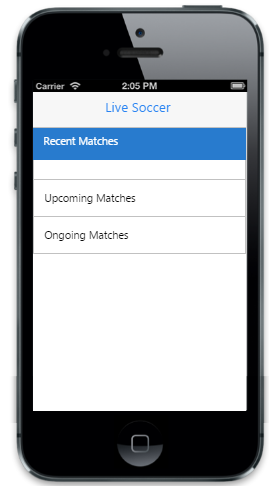

# Getting Started

## Create your first Accordion in JavaScript

Essential JavaScript Accordion provides a way to display collapsible content panels to present information in a limited amount of space. In the following guidelines, you can learn to create a Live Soccer App and through that you can learn about the features in Accordion widget.

In the above screenshot, you can click headers to expand/collapse content. You can also load content on demand, by specifing the URL to be loaded.

## Create the required layout

Essential JavaScript Accordion widget is rendered, either by specifying static content, or by using on demand contents by specifying the respective URL. Either case, Accordion control is rendered based on the default values for all the properties; you can easily customize Accordion control by changing its properties according to your requirements. In the Live Soccer App, three panels are required; one for displaying the Recent Matches, second for listing out the Upcoming Matches and another for displaying the Ongoing Match Updates on the Live Soccer App. The following steps will guide you to create a basic Accordion for your application.

Create an HTML file and add the following template to the HTML file to create Accordion.



<!DOCTYPE html>

<html>

<head>

    <title>Accordion</title>

    <link href="[http://cdn.syncfusion.com/13.1.0.21/js/mobile/ej.mobile.all.min.css](http://cdn.syncfusion.com/13.1.0.21/js/mobile/ej.mobile.all.min.css)" rel="stylesheet" />

    

    

    

    

</head>

<body>

    

        

        

            

                <!--Add Accordion Elements here.-->

            

        

        <!--Scroll Panel-->

        

    

</body>

</html>



To render Accordion control, set ejmaccordion as data-role attribute to 
 element, and include a list of Accordion items, through <li> element, to be added. Add the data-ej-text attribute to set text for each item.



        <!--Accordion Control-->

        <div id="accordionControl" data-role="ejmaccordion">

          <ul>

            <!--Accordion Panel 1-->

            <li data-ej-text="Recent Matches">

              

                 <!--Content-->

              

            </li>

            <!--Accordion Panel 2-->

            <li data-ej-text="Upcoming Matches">

             

                 <!--Content-->

             

            </li>

            <!--Accordion Panel 3-->

            <li data-ej-text="Ongoing Matches">

            </li>

          </ul>

        



Run this code example and you can see the following output.

## Select Accordion Item

The data-ej-selecteditems attribute is used to expand the specific content section, initially by using its index value. Multiple content sections can be expanded at a time. It accepts numeric array type. The default value of selecteditems is [0]. So the first panel will be in an expanded state. But in this case example you need all the panels in collapsed state, initially. So you need to set data-ej-selecteditems attribute with the value [-1].



       <!--Accordion Control-->

        <div id="accordionControl" data-role="ejmaccordion"

         data-ej-selecteditems="[-1]">

          <ul>

            <!--Accordion Panel 1-->

            <li data-ej-text="Recent Matches">

            </li>

            <!--Accordion Panel 2-->

            <li data-ej-text="Upcoming Matches">

              

                 <!--Content-->

              

            </li>

            <!--Accordion Panel 3-->

            <li data-ej-text="Ongoing Matches">

           </li>

          </ul>

        



Run this code example and you can see the following output.

## Enable Header Icons

By default, header icons are not visible. To make the icons visible, set data-ej-showHeadericon attribute to true.



        <!--Accordion Control-->

        <div id="accordionControl" data-role="ejmaccordion"

         data-ej-selecteditems="[-1]" data-ej-showheadericon="true">

          <ul>

            <!--Accordion Panel 1-->

            <li data-ej-text="Recent Matches">

             

                <!--Content-->

             

            </li>

            <!--Accordion Panel 2-->

            <li data-ej-text="Upcoming Matches">

              

                 <!--Content-->

              

            </li>

            <!--Accordion Panel 3-->

            <li data-ej-text="Ongoing Matches">

            </li>

          </ul>

        



## Make Accordion Collapsible

By default, all the content sections are not collapsible. To make all its content section collapsible, set data-ej-collapsible attribute to true.



        <!--Accordion Control-->

        <div id="accordionControl" data-role="ejmaccordion"

         data-ej-selecteditems="[-1]" data-ej-showheadericon="true"

         data-ej-collapsible="true" >

          <ul>

            <!--Accordion Panel 1-->

            <li data-ej-text="Recent Matches">

              

                <!--Content-->

              

            </li>

            <!--Accordion Panel 2-->

             <li data-ej-text="Upcoming Matches">

              

                 <!--Content-->

              

            </li>

            <!--Accordion Panel 3-->

            <li data-ej-text="Ongoing Matches">

           </li>

          </ul>

        



## Add Content

In the case example given, the contents of the Recent Matches and Upcoming Matches panels are given as static. In these content panels, the team results and match schedules are listed.

The following code example is used to add Recent Matches and Upcoming Matches panels’ content.



       <!--Accordion Control-->

       <div id="accordionControl" data-role="ejmaccordion"

        data-ej-selecteditems="[1]" data-ej-showheadericon="true"

        data-ej-collapsible="true">

          <ul>         

             <!--Accordion Panel 1-->

            <li data-ej-text="Recent Matches">

             

             <!--Content-->

                <div class="message-title">Crystal Palace – 3

                    <div class="time-panel">6th May

                  <div class="message-title">Liverpool - 3

                  <div class="text-panel">Match Drawn

                  

                <div class="border-panel">

                <div class="message-title">Arsenal – 1

                    <div class="time-panel">4th May

                  <div class="message-title">West Brom - 0

                  <div class="text-panel">Arsenal won the match

                  

                <div class="border-panel">

                <div class="message-title">Rayo – 0

                    <div class="time-panel">3rd May

                  <div class="message-title">Athletic - 3

                  <div class="text-panel">Athletic won the match

                  

              

            </li>

              <!--Accordion Panel 2-->                           

             <li data-ej-text="Upcoming Matches">

              

                <!--Content-->

                  <div class="message-title">Man City

                      <div class="time-panel">8th May

                    <div class="text-panel">vs

                    <div class="message-title">Aston Villa

                    

                  <div class="border-panel">

                  <div class="message-title">Valladolid

                      <div class="time-panel">8th May

                   <div class="text-panel">vs

                   <div class="message-title">Real Madrid

                    

                  <div class="border-panel">

                  <div class="message-title">Villarreal

                      <div class="time-panel">10th May

                   <div class="text-panel">vs

                   <div class="message-title">Rayo

                    

              

            </li>

            <!--Accordion Panel 3-->

              <li data-ej-text="Ongoing Matches">

             </li>

          </ul>

      



Use the following styles for content style.



           .appview .sample{

               padding:20px;

           }

           .appview .message-title{

              font-weight: bold;

              padding-bottom: 5px;

              padding-top: 8px;

           }

           .appview .text-panel{

              padding-bottom: 5px;

           }

           .appview .border-panel{

              border-bottom-width: 1px;

              border-bottom-color: #C0C0C0;

              border-bottom-style: solid;

              padding-top: 5px;

           }

           .appview .time-panel{

                float: right;

                font-weight: bold;

            }



## Load content-on-demand

In some cases, you can load content only when it is required. In this case, the Ongoing Matches panel needs to be loaded only when you want to check for updates, since it refers a live content. To achieve this, specify data-ej-ajaxurl attribute with the respective URL of the HTML file that contains the dynamic content.



       <!--Accordion Control-->

       <div id="accordionControl" data-role="ejmaccordion"

        data-ej-selecteditems="[2]" data-ej-showheadericon="true"

        data-ej-collapsible="true">

          <ul>         

             <!--Accordion Panel 1-->

            <li data-ej-text="Recent Matches">

             

             <!--Content-->

                <div class="message-title">Crystal Palace – 3

                    <div class="time-panel">6th May

                  <div class="message-title">Liverpool - 3

                  <div class="text-panel">Match Drawn

                  

                <div class="border-panel">

                <div class="message-title">Arsenal – 1

                    <div class="time-panel">4th May

                  <div class="message-title">West Brom - 0

                  <div class="text-panel">Arsenal won the match

                  

                <div class="border-panel">

                <div class="message-title">Rayo – 0

                    <div class="time-panel">3rd May

                  <div class="message-title">Athletic - 3

                  <div class="text-panel">Athletic won the match

                  

              

            </li>

              <!--Accordion Panel 2-->                           

             <li data-ej-text="Upcoming Matches">

              

                <!--Content-->

                  <div class="message-title">Man City

                      <div class="time-panel">8th May

                    <div class="text-panel">vs

                    <div class="message-title">Aston Villa

                    

                  <div class="border-panel">

                  <div class="message-title">Valladolid

                      <div class="time-panel">8th May

                   <div class="text-panel">vs

                   <div class="message-title">Real Madrid

                    

                  <div class="border-panel">

                  <div class="message-title">Villarreal

                      <div class="time-panel">10th May

                   <div class="text-panel">vs

                   <div class="message-title">Rayo

                    

              

            </li>

            <!--Accordion Panel 3-->

              <li data-ej-text="Ongoing Matches" data-ej-ajaxurl="load.html">

             </li>

          </ul>

      



Create an HTML file with the name load.html and assign its URL to data-ej-ajaxurl attribute.



<html>

<head>

      <meta charset="UTF-8">

    <title></title>

</head>

<body>

      

        <div class="message-title">

            Brighton & Hove Albion  - 1

       <div class="time-panel">

            FT

       <div class="text-panel">vs

       <div class="message-title">

            Derby County  - 2

        <div class="border-panel">

        <div class="message-title">

            Manchester United - 3

       <div class="time-panel">

            FT

       <div class="text-panel">vs

       <div class="message-title">

            Hull City  -  1

       <div class="border-panel">

       <div class="message-title">

            Empoli

       <div class="time-panel">

            19:00

        

       <div class="text-panel">vs

       <div class="message-title">

            Crotone

       

      

</body>

</html>



## Disable Cache

By default, cache is enabled. So when you load the Ongoing Matches content, it will load its dynamic content, from the specified location only once. The next time, it will load the same content from cache. In the case example, you need to load the dynamic content on every request by clicking its header. To achieve this, set data-ej-enablecache attribute to False.



<!--Accordion Control-->

       <div id="accordionControl" data-role="ejmaccordion"

        data-ej-selecteditems="[2]" data-ej-showheadericon="true"

        data-ej-collapsible="true" data-ej-enablecache="false">

          <ul>         

             <!--Accordion Panel 1-->

            <li data-ej-text="Recent Matches">

             

             <!--Content-->

                <div class="message-title">Crystal Palace – 3

                    <div class="time-panel">6th May

                  <div class="message-title">Liverpool - 3

                  <div class="text-panel">Match Drawn

                  

                <div class="border-panel">

                <div class="message-title">Arsenal – 1

                    <div class="time-panel">4th May

                  <div class="message-title">West Brom - 0

                  <div class="text-panel">Arsenal won the match

                  

                <div class="border-panel">

                <div class="message-title">Rayo – 0

                    <div class="time-panel">3rd May

                  <div class="message-title">Athletic - 3

                  <div class="text-panel">Athletic won the match

                  

              

            </li>

              <!--Accordion Panel 2-->                           

             <li data-ej-text="Upcoming Matches">

              

                <!--Content-->

                  <div class="message-title">Man City

                      <div class="time-panel">8th May

                    <div class="text-panel">vs

                    <div class="message-title">Aston Villa

                    

                  <div class="border-panel">

                  <div class="message-title">Valladolid

                      <div class="time-panel">8th May

                   <div class="text-panel">vs

                   <div class="message-title">Real Madrid

                    

                  <div class="border-panel">

                  <div class="message-title">Villarreal

                      <div class="time-panel">10th May

                   <div class="text-panel">vs

                   <div class="message-title">Rayo

                    

              

            </li>

            <!--Accordion Panel 3-->

              <li data-ej-text="Ongoing Matches" data-ej-ajaxurl="load.html">

             </li>

          </ul>

      



From the above steps, you have learnt how to create and customize Essential JS mobile Accordion widget with case examples. There are more customization properties other than the one used here.