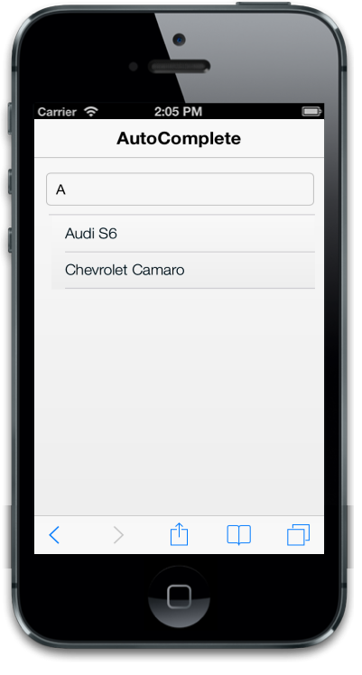
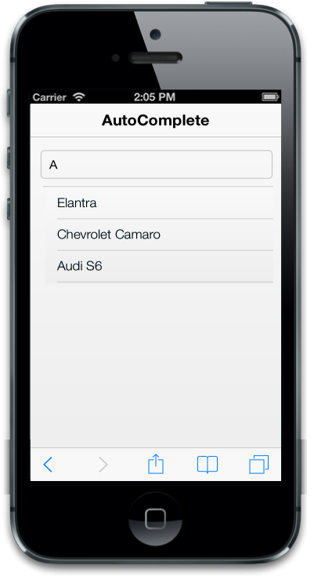
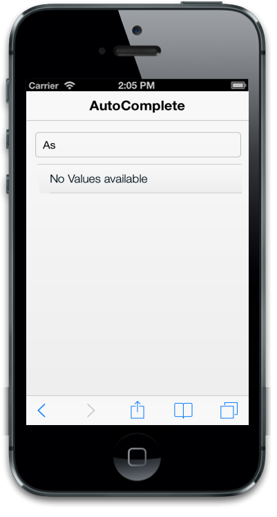

# Customize suggestion list

## Items count

The data-ej-itemscount attribute specifies the number of items to be displayed in the suggestion list. By default, the value for the attribute is “5”.



<input id="autocomplete_sample" data-role="ejmautocomplete" data-ej-itemscount=2 data-ej-datasource="window.datasrc" data-ej-fields-text="name" />         



The following screenshot displays items count:

## FilterType

The data-ej-filtertype attribute is used to filter and display the suggestion list based on your requirements. The possible values are, 

1. Startswith
2. Contains

By default, the value for the attribute is “contains”.



<input id="autocomplete_sample" data-role="ejmautocomplete" data-ej-datasource="window.datasrc" data-ej-filtertype="startswith" data-ej-fields-text="name" />



## EnableDistinct

The data-ej-enabledistinct attribute is used to hide or show the duplicate items from the suggestion list. By default, the value for the attribute is “false”.



<input id="autocomplete_sample" data-role="ejmautocomplete" data-ej-enabledistinct=true data-ej-datasource="window.datasrc"  data-ej-fields-text="name" />



## Scrolling

The data-ej-allowscrolling attribute defines whether to allow the scrolling functionality or not in the suggestion list. Default value is set to true.



<input id="autocomplete_sample" data-role="ejmautocomplete" data-ej-allowscrolling=false data-ej-datasource="window.datasrc" data-ej-fields-text="name" /> 



The following screenshot displays the output:

## Sorting 

The data-ej-allowsorting attribute enables the sorting operation for the suggestion list. When it is set to true, the suggestion list is displayed in the sorting order that can be given by using the “data-ej-sortorder” attribute.

The possible values are,

1. Ascending
2. Descending



 <input id="autocomplete_sample" data-role="ejmautocomplete" data-ej-sortorder="descending" data-ej-allowsorting=true data-ej-datasource="window.datasrc" data-ej-fields-text="name" />



The following screenshot displays sorting:

## EmptyResult

The data-ej-showemptyresulttext attribute is used to show or hide the suggestion box when there is no suggestion available for the user query. By default, the value is “true”.

The data-ej-emptyresulttext attribute is used to customize the text that is displayed when no results appear in the suggestion list. By default, the value is “No Suggestions”.



<input id="autocomplete_sample" data-role="ejmautocomplete" data-ej-showemptyresulttext="true" data-ej-emptyresulttext="No Values available" data-ej-datasource="window.datasrc" data-ej-fields-text="name" /> 



The following screenshot displays empty result

