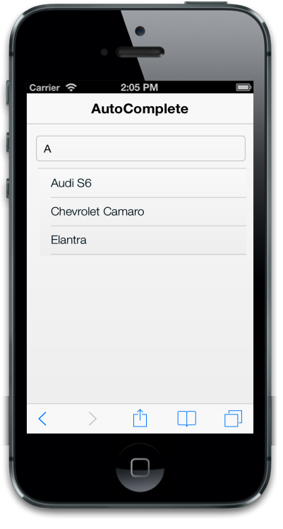
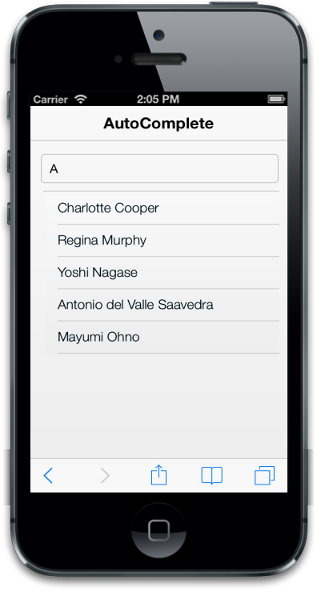

## Databinding

### Local Databinding

The data-ej-datasource attribute is used to provide the suggestion list to the AutoComplete. The list of items are passed as an array and by using the data-ej-datasource attribute, AutoComplete retrieves the suggestion list. The data-ej-fields-text attribute is used to map the specific field name of the given DataSource to render the suggestion list when user type is in the textbox. You can refer to the following code example. Here “window.datasrc” refers to JSON data.



<input id="autocomplete_sample" data-role="ejmautocomplete" data-ej-datasource="window.datasrc" data-ej-fields-text="name" />



Add the Following script.



        window.datasrc = [

{ 'name': 'Audi S6' },

{ 'name': 'BMW 7' },

{ 'name': 'Chevrolet Camaro' },

{ 'name': 'Duesenberg J' },

{ 'name': 'Elantra' }

];



The following screenshot displays the DataSource:

{  | markdownify }
{:.image }

### Remote Databinding

The data-ej-mapper attribute is used to specify the remote URL of the DataSource for the suggestion list. 



<input id="autocomplete_sample" data-role="ejmautocomplete" data-ej-fields-text="ContactName" data-ej-mapper="http://mvc.syncfusion.com/Services/Northwnd.svc/Suppliers" />



The following screenshot displays remote data binding:

{  | markdownify }
{:.image }

