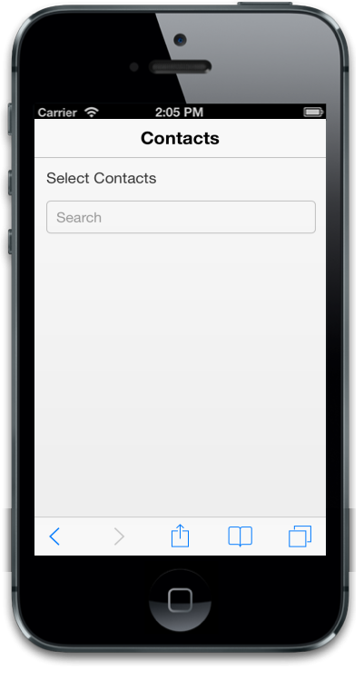
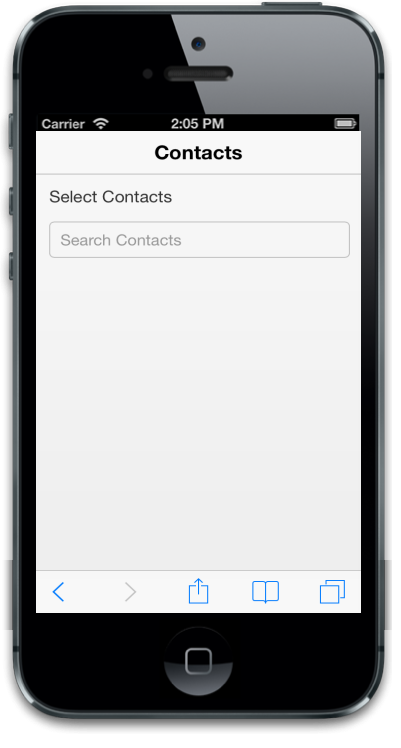
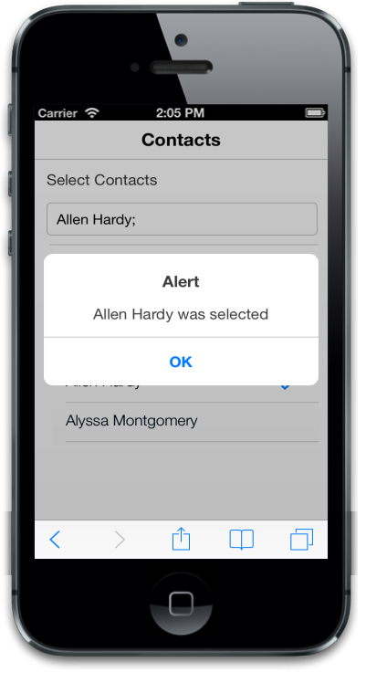

# Getting Started

The Essential JavaScript Mobile AutoComplete control is a text box control that provides a list of suggestions based on the query.  When you enter a text into the text box, the control performs a search operation and provides a list of results. There are several filter types available to perform the search. In following example, you will learn how to create an application to search a contact and learn about the features in AutoComplete widget.

{  | markdownify }
{:.image }

## Create AutoComplete to search for a contact

Essential JavaScript Mobile AutoComplete control can be rendered using a simple HTML textbox. It is rendered based on the default values for all the properties; you can easily customize Mobile AutoComplete control by changing its properties. The following code example shows how to create a search contact. 

Create an HTML file and paste the following template to the html file for AutoComplete creation.



<!DOCTYPE html>

<html>   

<head>

<title> Autocomplete</title>

<link href="[http://cdn.syncfusion.com/13.1.0.21/js/mobile/ej.mobile.all.min.css](http://cdn.syncfusion.com/13.1.0.21/js/mobile/ej.mobile.all.min.css)" rel="stylesheet" />

                

</head>

<body>

    <div id="page" data-role="appview">

        <!-- Header control -->

        <div id="header" data-role="ejmheader" data-ej-title="Contacts">

        

        <div id="content">

                    <div style="padding: 5px 0; text-indent: 5px;">

                         Select Contacts

            

               <!--Adds Autocomplete Elements here.-->

            

        
 
        <!-- Scroll panel -->

        <div data-role="ejmscrollpanel" data-ej-target="content">

    

</body>

</html>



To render the AutoComplete control, set “data-role” attribute to “ejmautocomplete” to an input element. 



     <!-- Autocomplete control -->

     <input id="contacts" data-role="ejmautocomplete" />



{  | markdownify }
{:.image }

You can customize its watermark text using data-ej-watermarktext attribute.



<!-- Autocomplete control -->

<input id="contacts" data-role="ejmautocomplete" data-ej-watermarktext="Search Contacts" />



{  | markdownify }
{:.image }

## Data binding

To add data source to AutoComplete control, you can set data-ej-datasource attribute value with the particular data source name. You need to assign the necessary column (field) name of the data source to data-ej-fields-text attribute.



     <!-- Autocomplete control -->
     <!-- The data source "window.contacts" is referred from contacts.min.js-->

     <input id="contacts" data-role="ejmautocomplete"
     data-ej-watermarktext="Search Contacts" data-ej-datasource="window.contacts" data-ej-fields-text ="name"/>



Execute the code and type the necessary query (here “A”) in the AutoComplete textbox, you can see the following output.

For more details, to run the samples refer "Common Getting Started" section.

{  | markdownify }
{:.image }

## Multi value selection

Autocomplete textbox enables you to select multiple items from the suggestion list. To achieve this, set the data-ej-enablemultiselect attribute to true. The data-ej-delimiterchar attribute holds a string value that specifies the separator between two selected items. You can customize the delimiter string. In this example “;” is used as delimiter.



<label>Select Contacts</label>
     <!-- Autocomplete control -->
<input id="contacts" data-role="ejmautocomplete" data-ej-watermarktext="Search Contacts" data-ej-datasource="window.contacts" data-ej-fields-text ="name" data-ej-enablemultiselect=true data-ej-delimiterchar=";"/>



Run the above code and type the necessary query in the textbox. The contact is displayed as shown in the following screenshot.

{  | markdownify }
{:.image }

## Event handling

The data-ej-select attribute enables you to handle AutoComplete selection event, by assigning a function name to the attribute. In this case, you can set data-ej-select attribute with the function name OnSelect.  By executing the onSelect( ) function you can implement necessary action and show the full contact details of the selected contact name.



             <!-- Autocomplete control -->

    <input id="contacts" data-role="ejmautocomplete" data-ej-watermarktext="Search Contacts" data-ej-datasource="window.contacts" data-ej-fields-text="name" data-ej-enablemultiselect="true" data-ej-delimiterchar=";" data-ej-select="onSelect" />

     <!-- onSelect() function is called on selection of a suggestion item.-->

     <!-- Dialog control -->

     <div id="dialog" data-role="ejmdialog" data-ej-title="Alert" data-ej-enablemodal=true
         data-ej-leftbuttoncaption="OK" data-ej-buttontap="hidedialog">

        <div id="dialogcontent"><!-- Dialog content -->

     



Add the following script.



function onSelect(args) {

            //Actions that are performed on selection

            $("#dialogcontent").html(args.text + " was selected");

            var dialogobj = $("#dialog").data("ejmDialog");

            dialogobj.open();

        }

        function hidedialog(e) {

            //Hides dialog

            var dialogobj = $("#dialog").data("ejmDialog");

            dialogobj.close();

        } 



Add the following style



.appview.e-m-windows.e-m-light #content {

        background: none repeat scroll 0 0 #eee;

    }

    #content {

        padding: 8px;

    }



Run the code to render the following output.

{  | markdownify }
{:.image }

