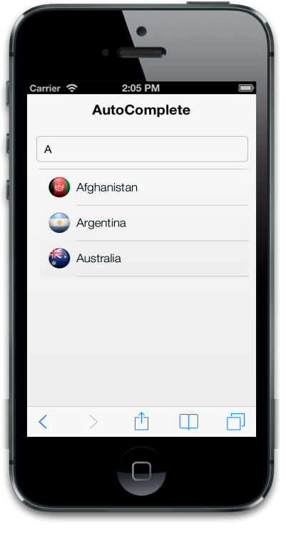

# ImageClass

The data-ej-imageclass attribute is used to map the specific field name of the given DataSource to render the icons/images for each suggestion list. The mapped field should contain the CSS class names that define the icons/images for each suggestion list. You can customize the CSS class definitions for icons of each suggestion list based on the need.



<input id="autocomplete_sample" data-role="ejmautocomplete" data-ej-datasource="window.datacont" data-ej-fields-text="country" data-ej-imageclass="flag" />



Add the following script



        var datacont = [

{

"country": "Afghanistan",

"flag": "afghan"

},

{

"country": "Argentina",

"flag": "argen"

},

{

"country": "Australia",

"flag": "aust"

}];



Add the following style.



        .afghan {

        background-image: url("../themes/sample/autocomplete/afghanistan.png");

        background-position: center center;

        background-size: 30px 30px;

        }

        .argen {

        background-image: url("../themes/sample/autocomplete/argentina.png");

        background-position: center center;

       background-size: 30px 30px;

        }

        .aust {

        background-image: url("../themes/sample/autocomplete/australia.png") ;

        background-position: center center;

        background-size: 30px 30px;

        }



The following screenshot displays ImageClass:

