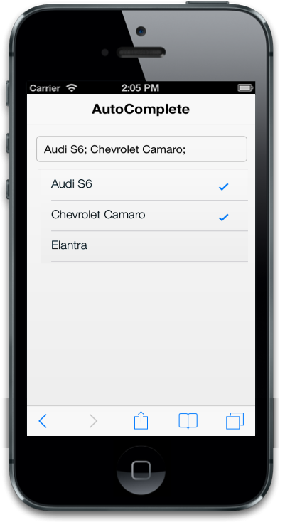

# Multi Selection

This feature is enabled by setting the data-ej-enablemultiselect attribute to true. This attribute helps you to select multiple list items from the suggestions list.

## DelimiterChar

The data-ej-delimiterchar is used to separate two or more items in the AutoComplete textbox. If you set data-ej-delimiterchar attribute, the selected value gets added in the textbox only after the delimiter character is placed. Default value is “,”.

You can refer to the following code examples.



<input id="autocomplete_sample" data-role="ejmautocomplete"  data-ej-enablemultiselect=true data-ej-delimiterchar=";" data-ej-datasource="window.datasrc" data-ej-fields-text="name" />



The following screenshot displays the DelimiterChar:

## EnableCheckBox

The data-ej-enablecheckbox attribute is used to display the checkbox for the suggestion list. This attribute is rendered only in the multi selection mode. By default, the value is set to “true”.



<input id="autocomplete_sample" data-role="ejmautocomplete"  data-ej-enablemultiselect=true data-ej-enablecheckbox="true" data-ej-datasource="window.datasrc" data-ej-fields-text="name" />    



The following screenshot displays EnableCheckBox:

