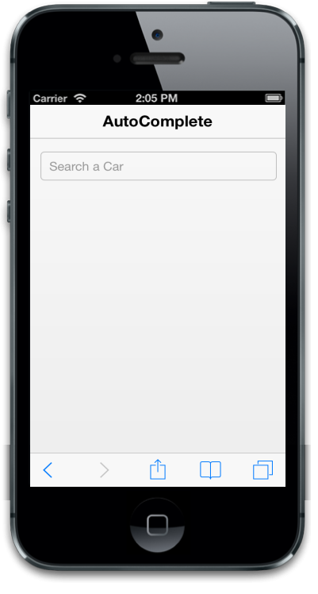

# Customize WatermarkText

The data-ej-watermarktext attribute displays text in the AutoComplete textbox when it is empty. It acts like a label for the textbox. When you enter the query, the watermarktext disappears and the typed text is entered in the textbox. Default value for the attribute is set to “search”.



<input id="autocomplete_sample" data-role="ejmautocomplete" data-ej-watermarktext="Search a Car" data-ej-datasource="window.datasrc" data-ej-fields-text="name" />    



The following screenshot displays Watermark text:

