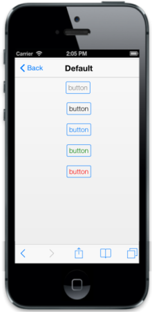
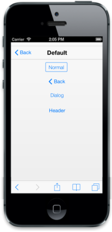

# IOS7 specific customization

## Color

This property is specific to IOS7 RenderMode that allows you to set the color of the Button when used as an action link to indicate the state of the link. 

You can set the text color of the Button using ‘data-ej-ios7-color’ attribute.

You can refer to the following code example.



        <a id="sample_button" data-role="ejmbutton" data-ej-text="button" data-ej-rendermode="ios7" data-ej-ios7-color="gray" />   

        <a id="sample_button" data-role="ejmbutton" data-ej-text="button" data-ej-rendermode="ios7" data-ej-ios7-color="black" />  

        <a id="sample_button" data-role="ejmbutton" data-ej-text="button" data-ej-rendermode="ios7" data-ej-ios7-color="blue" />  

        <a id="sample_button" data-role="ejmbutton" data-ej-text="button" data-ej-rendermode="ios7" data-ej-ios7-color="green"/>  

        <a id="sample_button" data-role="ejmbutton" data-ej-text="button" data-ej-rendermode="ios7" data-ej-ios7-color="red" />  



## Styles

By using data-ej-ios7-style attribute, you can customize the style of the button.

The possible values are:

1. Normal
2. Back
3. Dialog
4. Header

You can refer to the following code example.



        <input type="button" id="sample_button" data-role="ejmbutton" data-ej-text="Normal" data-ej-rendermode="ios7" data-ej-ios7-style="normal" />  

        <a id="sample_button1" data-role="ejmbutton" data-ej-text="Back" data-ej-rendermode="ios7" data-ej-ios7-style="back" />

        <input type="button" id="sample_button2" data-role="ejmactionlink" data-ej-text="Dialog" data-ej-rendermode="ios7" data-ej-ios7-style="dialog"/>

        <input type="button" id="sample_button3" data-role="ejmactionlink" data-ej-text="Header" data-ej-rendermode="ios7" data-ej-ios7-style="header"/>



