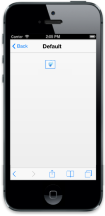

# ImageClass

In your application, you can include image inside the Button. In that case, you can use ImageClass for Button control where you can specify the image as a class to be displayed in the Button. Set the ContentType to ‘image’. 

You can refer to the following code example.



<input id="sample_button" type="button" data-role="ejmbutton" data-ej-contenttype="image" data-ej-imageclass="image" />



Add the following styles to the content



.image {

	background-image: url("silverlight.jpg");

}
		


