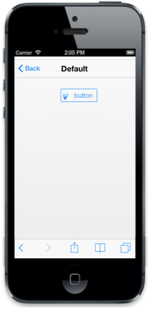

# ImagePosition

You can also set the position of the image in the Button. This can be achieved by using ImagePosition property. You can set the position of the image in the Button either after the text or before text by setting the image position to ‘right’ or ‘left’ respectively.

By default this property is set to ‘left’.

You can refer to the following code example.



<input id="sample_button" type="button" data-role="ejmbutton" data-ej-contenttype="both" data-ej-text="button" data-ej-imageposition="left" data-ej-imageclass="image" />



