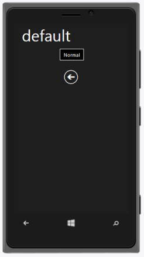

# Windows Specific Customization

By using data-ej-windows-style attribute, you can customize the style of the button. 

The possible values are

1. Normal
2. Back

You can refer to the following code example.



	<input type="button" id="sample_button1" data-role="ejmbutton" data-ej-text="Normal" data-ej-rendermode="windows" data-ej-windows-style="normal" />  

	<a id="sample_button2" data-role="ejmbutton" data-ej-text="Back" data-ej-rendermode="windows" data-ej-windows-style="back" />



