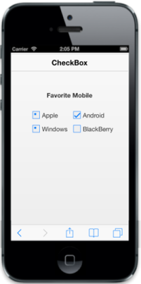

# Enable Tri-State

Sometimes, to represent the answer in partially true state, you can use the indeterminate state option that is the state between checked and unchecked state. For example, a Checkbox presented to select files to send via [FTP](http://en.wikipedia.org/wiki/File_Transfer_Protocol) can use a [tree view](http://en.wikipedia.org/wiki/Tree_view) so that files can be selected one at a time, or by folder. When only some files in a folder are selected, then the checkbox for that folder could be in indeterminate state.

When you enable Tri-state, then the Checkbox includes the indeterminate state. The Checkbox has three states. Data-ej-enabletristate attribute specifies to enable or disable the Tri-State option for Checkbox.

In the HTML page, add the following input elements to render the Checkbox with Tri-state options.



  

    <b> Favorite Mobile</b>

  

   

  <table border="0" cellpadding="6">

  	<tr>
		
		<td width="100px">

        	<input id="apple" name="chkbox" data-role="ejmcheckbox" data-ej-text="Apple" data-ej-checkstate="indeterminate" data-ej-enabletristate="true"/>

        </td>

        <td width="100px">

            <input id="android" name="chkbox" data-role="ejmcheckbox" data-ej-text="Android" data-ej-checkstate="check" data-ej-enabletristate="true"/>

        </td>

    </tr>

    <tr>

       <td width="100px">

           <input id="windows" name="chkbox" data-role="ejmcheckbox" data-ej-text="Windows" data-ej-checkstate="indeterminate" data-ej-enabletristate="true" />

       </td>

       <td width="100px">

           <input id="Bberry" name="chkbox" data-role="ejmcheckbox" data-ej-text="BlackBerry" />

       </td>

    </tr>

  </table>



Execute the above code example to render the following output.

