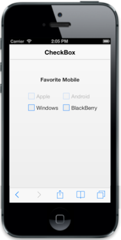

## Enabled

You can render Checkbox with disabled state by setting data-ej-enabled to false. Sometimes, to disable a checkbox during ‘out of stock’ like situations, you can use this property. By default, this data-ej-enabled is set to true.

Refer to the following code example.



    

    

        

            <b> Favorite Mobile</b>

        

         

        <table border="0" cellpadding="6">

            <tr>

                <td width="100px">

                    <input id="apple" name="chkbox" data-role="ejmcheckbox" data-ej-text="Apple" data-ej-enabled="false" />

                </td>

                <td width="100px">

                    <input id="android" name="chkbox" data-role="ejmcheckbox" data-ej-text="Android" data-ej-enabled="false" />

                </td>

            </tr>

            <tr>

                <td width="100px">

                    <input id="windows" name="chkbox" data-role="ejmcheckbox" data-ej-text="Windows" />

                </td>

                <td width="100px">

                    <input id="Bberry" name="chkbox" data-role="ejmcheckbox" data-ej-text="BlackBerry" />

                </td>

            </tr>

        </table>

    



Execute the above code example to render the following output.

{  | markdownify }
{:.image }

