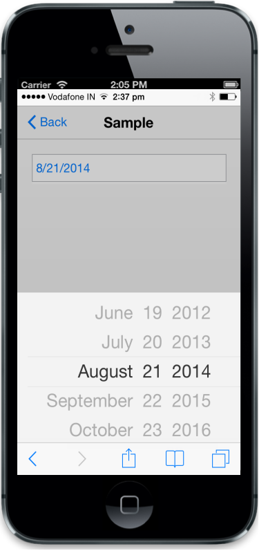

# Configure date

The data-ej-maxdate and data-ej-mindate attributes are used to denote the maximum and minimum selectable dates. You can format the date by using the data-ej-dateformat attributes. The current value for DatePicker can be set by using the data-ej-value attributes.



<input id="datepicker" data-role="ejmdatepicker"  data-ej-maxdate="10/10/2020" data-ej-mindate="05/05/2005" data-ej-value="08/21/2014" data-ej-dateformat="MM/dd/yyyy"/>



The following screenshot displays the output.

