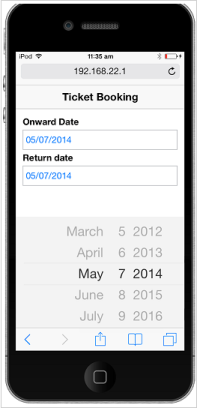
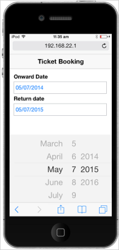
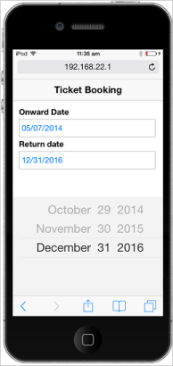

# Getting Started

This section briefly describes how to create a DatePicker control in your application.

## Create your first DatePicker in JavaScript

Essential Mobile JavaScript DatePicker provides support to display the picker element within your webpage and allows you to pick the date. By the following guidelines, you can learn how to customize two DatePickers for a real-time ticket booking scenario. The following screenshot demonstrates the functionality of DatePicker.

## Create a DatePicker

You can create DatePicker widget easily by using simple input element. 

1. Create an HTML file and add the following code example to it.

   ~~~ html
   
	   <!DOCTYPE html>
	   
	   <html>
	   
		   <head>
		   
			   <title>Ticket Booking</title>
			  			   
			   <link href="[http://cdn.syncfusion.com/13.1.0.21/js/mobile/ej.mobile.all.min.css](http://cdn.syncfusion.com/13.1.0.21/js/mobile/ej.mobile.all.min.css)" rel="stylesheet" />
			   
			                   
			   
			   
			   
			   
			   
			   
		   </head>
		   
		   <body>
		   
			   <div data-role="appview">
			   
				   
				   <div id="header" data-ej-position="normal" data-role="ejmheader">

				  
				   <!--Add Datepicker element here-->
			   
			   

		   
		   </body>
		   
	   </html>
	   
   ~~~ 

2. To set the header’s title in the layout, you can set data-ej-title attribute to the desired title. In this case you can set it as Ticket Booking.

   ~~~ html
   
		<div id="header" data-ej-title="Ticket Booking"  data-ej-position="normal" data-role="ejmheader">

   
   ~~~  

3. To render the DatePicker control, you can set ejmdatepicker to data-role attribute for the specific input element as follows.

   ~~~ html
   
	   <table>
	   
		   <tr>
		   		<td class="tdclass">Onward Date</td>
		   </tr>
		  
		   <tr>
		   		<td class="tdclass">
		   			<span class="innerdp">
						<input id="startDate" data-role="ejmdatepicker" />
		   			
		   		</td>
		   </tr>
		  
		   <tr>
				<td class="tdclass">Return date</td>
		   </tr>
		  
		   <tr>
				<td class="tdclass">
					<span class="innerdp">
						<input id="endDate" data-role="ejmdatepicker" />
					
				</td>
		   </tr>
		 
	   </table>
	 
   ~~~
   

4. Add the following styles to display DatePicker’s input element.

   ~~~ css
   
	   .tdclass
	   {
		   width: 300px;
		   font-weight: bold;
		   padding-bottom: 10px;
	   }
	   
	   table
	   {
		   margin: 30px auto;
	   }
	   
   ~~~
   

5. Run the above code example, to render the DatePicker.

   

## Set Min and Max Date 

In a real-time ticket booking scenario, the booking is open for a limited number of days only. You can select a date in that range. You can achieve this by using the attributes data-ej-mindate and data-ej-maxdate. 

The following script helps you to set the mindate and maxdate.



var curDate = new Date();// Mention the current date.

// The following code mentions 2 years from the current date.

var rangeDate = new Date(curDate.getFullYear() + 2, curDate.getMonth(), curDate.getDate());

// Sets minDate and maxDate at the time of document ready.

$(function () {

	var startdate = $("#startDate").data("ejmDatePicker");

	startdate.option({ "minDate": curDate, "maxDate": rangeDate });

	var enddate = $("#endDate").data("ejmDatePicker");

	enddate.option({ "minDate": curDate, "maxDate": rangeDate });

});



Run the above code example to render a DatePicker with Min and Max Date.

## Set Event to Process the Min and Max Date Validations

You can select Onward journey date in the first DatePicker. The Return journey date is selected in second date picker after selecting Onward journey date. This validation process is done after the selection of Onward journey date and the changes are reflected on the Return journey date selection DatePicker. Manipulate this process by using the Select event of Onward journey date DatePicker by using data-ej-select attribute. 

The following code example explains how to set an event to process the Min and Max Date Validations.



<table>

<tr>
  <td class="tdclass">Onward Date</td>
</tr>

	<tr>
	  <td class="tdclass">
		<span class="innerdp">
		  <input id="startDate" data-role="ejmdatepicker" data-ej-select="validateMinDateForReturn"/>
		
	  </td>
	</tr>                     

	<tr>
	  <td class="tdclass">Return date</td>
	</tr>

	<tr>
	  <td class="tdclass">
		<span class="innerdp">
		  <input id="endDate" data-role="ejmdatepicker" />
		
	  </td>
	</tr>

</table>



Select event is handled by the validateMinDateForReturn function as follows.



function validateMinDateForReturn (args) {

	var selDate = new Date(args.value); // Mentions the selected date.

	minDatepicker = $("#endDate").data("ejmDatePicker");// Creates DatePicker object

	minDatepicker.option({ "minDate": selDate });// Sets minDate property through setModel of DatePicker object.

}



Run the above code example to render the following output.

