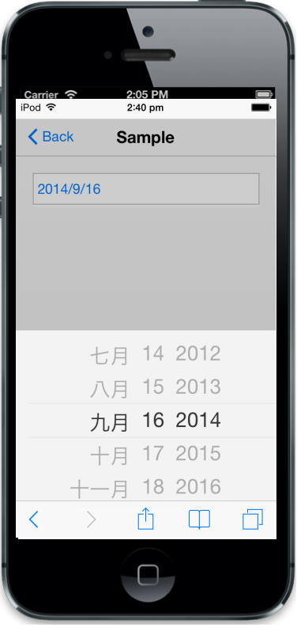

# Localization

The data-ej-culture attributes is used to enable the localization support. The default value is en-US.



<input id="datepicker" data-role="ejmdatepicker" data-ej-culture="zh-CN"/>



The following screenshot displays the output.

