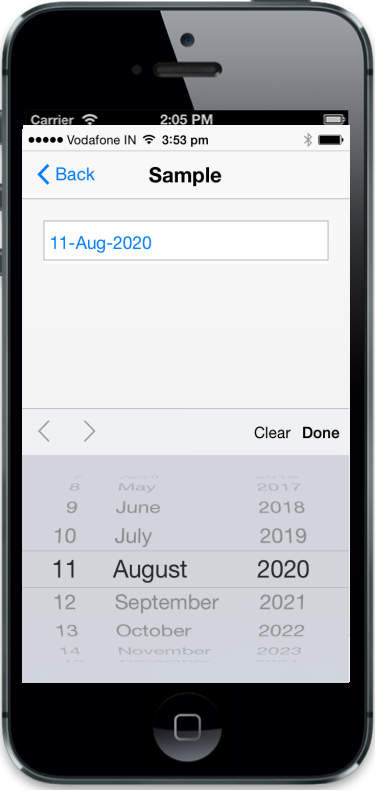

## Native DatePicker

The data-ej-renderdefault attributes is used to enable the iOS7 native DatePicker. But, by using iOS7 native DatePicker, you cannot customize its theme, provide localization support, etc. The default value is false.



<input id="datepicker" data-role="ejmdatepicker" data-ej-rendermode="ios7" data-ej-ios7-renderdefault=true />



The following screenshot displays the output.

{{ '' | markdownify }}
{:.image }

