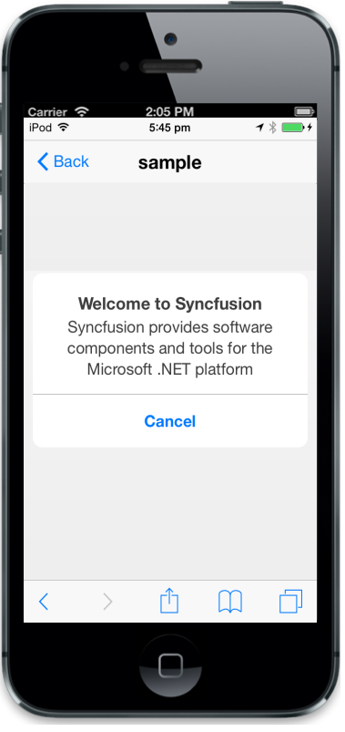

# Auto Open

The data-ej-enableautoopen attribute is used to set whether to open the Dialog box on initial loading. The default value is false.



            

            Syncfusion provides software components and tools for the Microsoft .NET 

            platform

            



The following screenshot displays the output.

