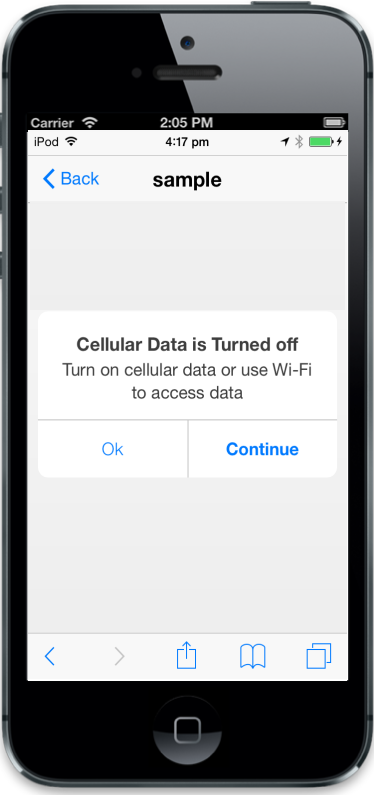
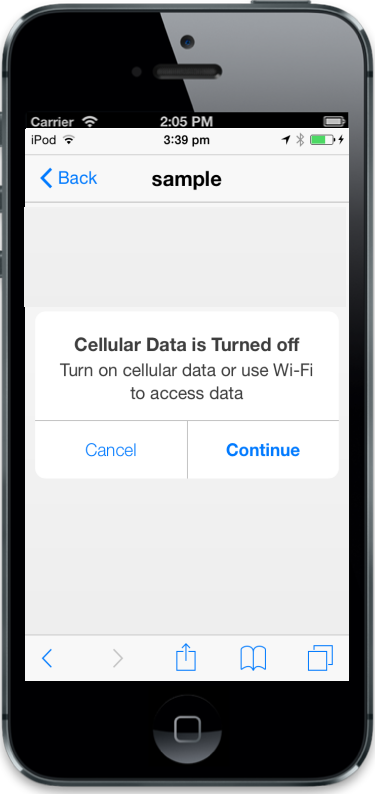
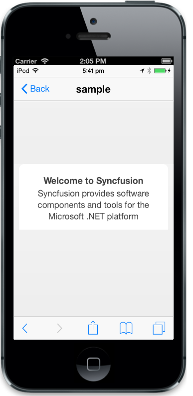

## Button Customization

### LeftButtonCaption

The data-ej-leftbuttoncaption attribute is used to specify the text of the Left Button. The default value is cancel.



      

       Turn on cellular data or use Wi-Fi to access data

     



The following screenshot displays the output.

{  | markdownify }
{:.image }

### RightButtonCaption

The data-ej-rightbuttoncaption attribute specifies the text of the Right Button. The default value is continue.



      

       Turn on cellular data or use Wi-Fi to access data

     



The following screenshot displays the output.

{  | markdownify }
{:.image }

### ShowButtons

The data-ej-showbuttons attribute is used to show the buttons in the Dialog box. The default value is true.



      

        Syncfusion provides software components and tools for the Microsoft .NET  

         platform

     



The following screenshot displays the output.

{  | markdownify }
{:.image }

