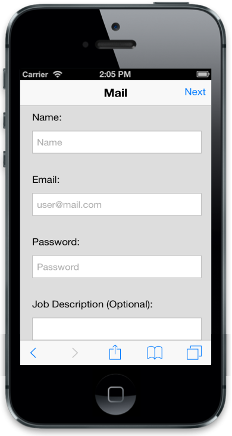
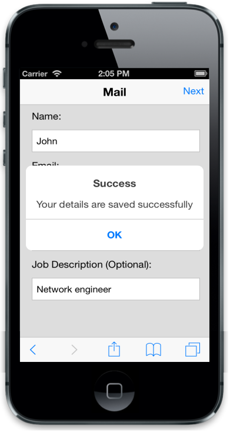
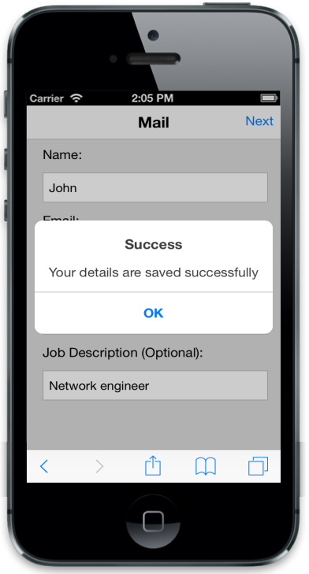

# Getting Started

This section explains briefly on how to create a Dialog control in your application.

## Create your first Menu in JavaScript

The Essential JavaScript Dialog window is an overlay positioned within the AppView and displays a message along with supplementary content such as images or text and interactive content such as forms, etc.  It contains a title and a content area. The following example explains how to create a Mail Sign in form through which you can learn the features of Mobile Dialog widget.

### Create the required layout

You can render the Dialog control based on the default values for all the properties. You can easily customize Dialog control by changing their properties according to your requirements.

1. Create an HTML file and add the following template to the HTML file for Mail sign in form creation.

   ~~~ html
   <!DOCTYPE html>
   <html>
   <head>
   <title>Dialog</title>
   <link href="[http://cdn.syncfusion.com/13.1.0.21/js/mobile/ej.mobile.all.min.css](http://cdn.syncfusion.com/13.1.0.21/js/mobile/ej.mobile.all.min.css)" rel="stylesheet" />
                   
   
   
   
   
   </head>
   <body>
   <div id="page" data-role="appview">
   <!-- header control -->
   <div id="header" data-role="ejmheader" data-ej-title="Mail" data-ej-position="fixed" data-ej-showrightbutton="true" data-ej-rightbuttoncaption="Next" data-ej-rightbuttontap="formsubmit">
   

   <div id="content">
   

   <!-- Add Mail Sign in Form Elements Here-->
   <form id="form1">
   <label>
   Name:
   </label>
   

   <input id="name_def" required data-role="ejmtextbox" data-ej-watermarktext="Name" />
   <label for="name_def" class="error" generated="true" />
   

   <label>
   Email:
   </label>
   

   <input id="email_def" type="email" required data-role="ejmtextbox" data-ej-watermarktext="user@mail.com" />
   <label for="email_def" class="error" generated="true" />
   

   <label>
   Password:
   </label>
   

   <input id="password_def" required data-role="ejmpassword"data-ej-watermarktext="Password" />
   <label for="password_def" class="error" generated="true" />
   

   <label>
   Job Description (Optional):
   </label>
   

   <input id="description_def" data-role="ejmtextbox" />
   

   </form>
   

   

   <!-- Add Dialog Elements Here -->
   <!-- ScrollPanel -->
   <div id="ScrollPanel" data-role="ejmscrollpanel" data-ej-target="content">
   

   

   </body>
   </html>
   ~~~
   

2. Add content element using the following styles. 

   ~~~ css
   .appview.e-m-ios7 #content {
   background: #dddddd;
   padding: 10px;
   }
   #form > div {
   padding: 10px 0;
   }
   .appview #form1 label.error {
   color: Red;
   }
   .e-m-ios7 label {
   padding-left: 10px;
   }
   .e-m-windows label {
   padding-left: 20px;
   }
   .e-m-android #content, .e-m-ios7 #content {
   padding: 10px;
   }
   .e-m-android #form1 {
   padding: 0px 10px;
   }
   .e-m-windows #content {
   padding: 3px;
   }
   ~~~
   

3. Run the code to render the following output. 

   

### Create the Dialog control

There are four types of Dialog modes namely alert, confirm, normal and full view Dialogs. The default Dialog mode is alert. In this scenario, an error message or alert message is displayed when invalid details are entered. Alert Dialog contains title, content and one button.

To render a Dialog, you can set data-role attribute of a 
 element to ejmdialog and inner 
 element is considered as the content of the Dialog. You can use data-ej-title attribute with the desired title to set Dialog title. In this case you can set it as Invalid email address. To set caption for Dialog button you can use data-ej-leftbuttoncaption attribute with the desired caption. In this application, set the caption as OK.  



        

            

                    <!-- Dialog Contents Here -->

            

        



## Display the Dialog

You can click the next button present in the header to display the Dialog. The click event is handled by formsubmit function as follows. You can create an object for Dialog control and display the Dialog using open function. 

Add the following code example to the <body> tag.



        function formsubmit(event) {

            validation();

            $("#form1").submit();

            $("#ScrollPanel").ejmScrollPanel("refresh");

        }

        function validation() {

            validator = $("#form1").validate({

                messages: {

                    name_def: { required: "Please enter user name" },

                    password_def: { required: "Please enter password" },

                    email_def: { required: "Please enter e-mail" }

                },

                submitHandler: function (form) {

                    var dialogObject = $("#alertdlg").data("ejmDialog"); // creating instance for dialog

                    dialogObject.open();

                    $("#contentDialog").text("Your details are saved successfully");

                }

            });

        }



Run the code to render the following output.

### Enable Modal Dialog

The Modal Dialog prevents you from interacting with the rest of the page until it is closed. To enable this, set data-ej-enablemodal attributes value to ‘true’.



            

            

        



Run this code to render the following output. 

### Handle Dialog events

To close the alert Dialog, click OK. This is achieved by triggering the buttontap event of Dialog using the data-ej-buttontap attribute. And the buttontap event is handled by alertClose function. Create an object for Dialog control and using close function you can close the Dialog.



<!-- Dialog control -->

        

            

            

        



Add the following script to the code



//Add script for closeDialog

        function alertClose(event) {

            var alertDlgInstance = $("#alertdlg").data("ejmDialog"); // Creates alert dialog instance

            alertDlgInstance.close(); //closes alert dialog

            $(".e-m-text-input").val("");

            $(".e-m-editor-input").val("");

        }



