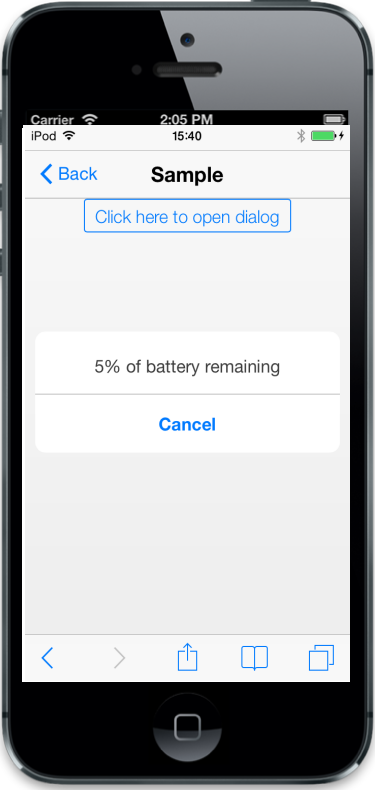
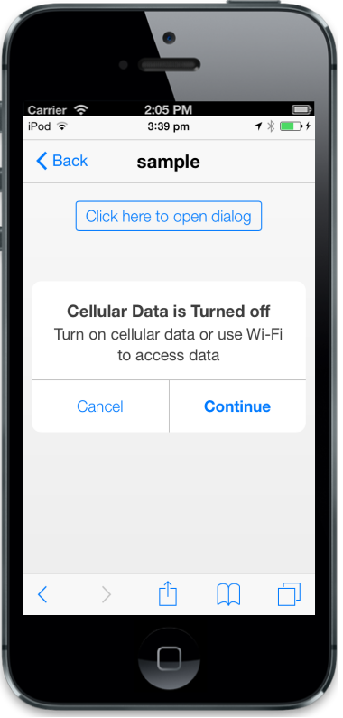
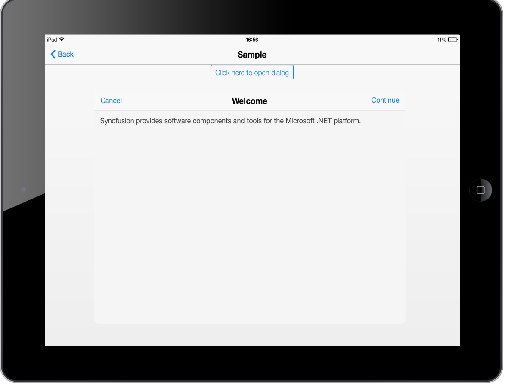
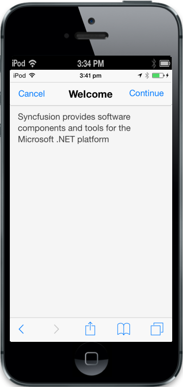

## Mode

The data-ej-mode attribute specifies the different types of dialog modes. The possible values are, 

1. Alert mode. 
2. Confirm mode.
3. Normal mode.
4. Full view mode.
### Alert Mode

The Alert Dialog mode is used to communicate an Alert message.



     

        5% of battery remaining

     

        <input data-role="ejmbutton" data-ej-text="Click here to open dialog"

       type="button" data-ej-touchend="openAlertDialog" />



Add the following script to the code



function openAlertDialog(args)

        {

            App.activePage.find("#alertdlg").ejmDialog("open");

        }



The following screenshot displays the output.

{  | markdownify }
{:.image }

### Confirm Mode

The Confirm Dialog box attribute is mostly used to take the user's consent on any option. It displays a Dialog box with two buttons, Ok and Cancel. Ok button returns true and Cancel button returns false.



    

       Turn on cellular data or use Wi-Fi to access data

    

       <input data-role="ejmbutton" data-ej-text="Click here to open dialog"

       type="button" data-ej-touchend="openAlertDialog" />



Add the following script to the code



function openAlertDialog(args)

        {

            App.activePage.find("#alertdlg").ejmDialog("open");

        }



The following screenshot displays the output.

{  | markdownify }
{:.image }

### Normal Mode

The Normal Mode Dialog box attribute is used to display the message in sub screen area on a whole screen. It displays a Dialog box with two buttons, Continue and Cancel. Continue button returns true and Cancel button returns false. It is suitable for tablet devices.



   

         Syncfusion provides software components and tools for the Microsoft .NET 

         platform.

    

        <input data-role="ejmbutton" data-ej-text="Click here to open dialog"

        type="button" data-ej-touchend="openAlertDialog" />



Add the following script to the code



function openAlertDialog(args)

        {

            App.activePage.find("#alertdlg").ejmDialog("open");

        }



The following screenshot displays the output.

{  | markdownify }
{:.image }

### Full View Mode

The FullView Dialog box attribute is used to display messages on full screen and it is suitable for mobile devices.



     

       Syncfusion provides software components and tools for the Microsoft .NET 

       platform.

     

      <input data-role="ejmbutton" data-ej-text="Click here to open dialog"

      type="button" data-ej-touchend="openAlertDialog" />



Add the following script to the code



function openAlertDialog(args)

        {

            App.activePage.find("#alertdlg").ejmDialog("open");

        }



The following screenshot displays the output.

{  | markdownify }
{:.image }

