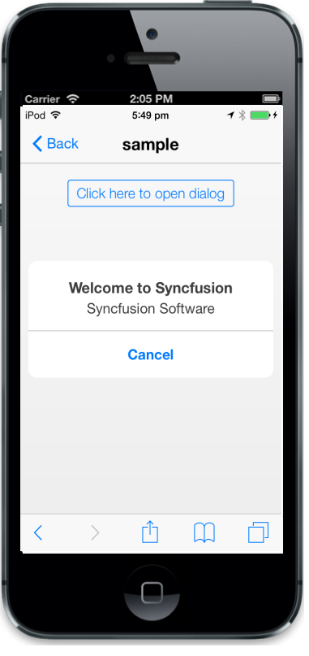

## Templating

The data-ej-templateid attribute is used to define the ID of the template element where you can specify the content to render in the Dialog.



   

       Syncfusion provides software components and tools for the Microsoft .NET 

       platform

   

   

       Syncfusion Software

   

       <input data-role="ejmbutton" data-ej-text="Click here to open dialog"

       type="button" data-ej-touchend="openAlertDialog" />



Add the following script to the code



function openAlertDialog(args)

        {

            App.activePage.find("#alertdlg").ejmDialog("open");

        }



The following screenshot displays the output.

{{ '' | markdownify }}
{:.image }

