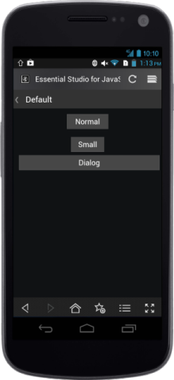

# Android Specific Customization

You can set the Android specific properties to the control by accessing Android property.

## Style

You can change the style of Android mode button by accessing data-ej-android-style attribute. 

The possible values are

1. Normal
2. Small
3. Dialog

You can refer to the following code example.



        <input type="button" id="sample_button" data-role="ejmbutton" data-ej-text="Normal" data-ej-rendermode="android" data-ej-android-style="normal" />  

        <input type="button" id="sample_button1" data-role="ejmbutton" data-ej-text="Small" data-ej-rendermode="android" data-ej-android-style="small" />

        <input type="button" id="sample_button2" data-role="ejmactionlink" data-ej-text="Dialog" data-ej-rendermode="android" data-ej-android-style="dialog" />

    



{{ '' | markdownify }}
{:.image }

