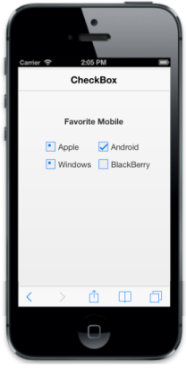

# CheckState

This enables you to specify the check state of the control by setting data-ej-checkstate.

The possible values are:

1. Check
2. Uncheck
3. Indeterminate

To set these three states, you need to set data-ej-enabletristate attribute as true.

Refer to the following code example.



    

    

        

            <b> Favorite Mobile</b>

        

         

        <table border="0" cellpadding="6">

            <tr>

                <td width="100px">

                    <input id="apple" name="chkbox" data-role="ejmcheckbox" data-ej-text="Apple" data-ej-checkstate="indeterminate"data-ej-enabletristate="true"/>

                </td>

                <td width="100px">

                    <input id="android" name="chkbox" data-role="ejmcheckbox" data-ej-text="Android" data-ej-checkstate="check" data-ej-enabletristate="true"/>

                </td>

            </tr>

            <tr>

                <td width="100px">

                    <input id="windows" name="chkbox" data-role="ejmcheckbox" data-ej-text="Windows" data-ej-checkstate="indeterminate"data-ej-enabletristate="true" />

                </td>

                <td width="100px">

                    <input id="Bberry" name="chkbox" data-role="ejmcheckbox" data-ej-text="BlackBerry" />

                </td>

            </tr>

        </table>

    



Execute the above code example to render the following output.

{{ '' | markdownify }}
{:.image }

