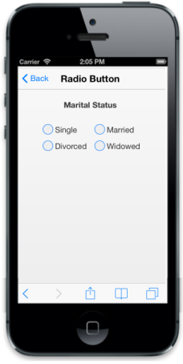

# Customize Label

The data-ej-text attribute lets you set labels for the RadioButton. To set the text for the RadioButton, you can refer the following code example.



    

         

        

            

                <b>Marital Status</b>

            

        

         

        <table border="0" cellpadding="5">

            <tr>

                <td width="100px">

                    <input type="radio" name="radbtn" data-role="ejmradiobutton" data-ej-text="Single"/>

                </td>

                <td>

                    <input name="radbtn" type="radio" data-role="ejmradiobutton" data-ej-text="Married" />

                </td>

            </tr>

            <tr>

                <td>

                    <input name="radbtn" type="radio" data-role="ejmradiobutton" data-ej-text="Divorced" />

                </td>

                <td>

                    <input name="radbtn" type="radio" data-role="ejmradiobutton" data-ej-text="Widowed" />

                </td>

            </tr>

        </table>

        

        

    



The following screenshot displays customized labels.

{{ '' | markdownify }}
{:.image }

