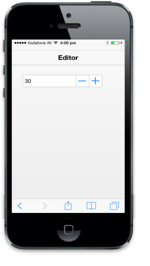

# Customize value

The current value of the Numeric Textbox can be specified by using data-ej-value attribute. The range for the Numeric Textbox can be specified by using the data-ej-maxvalue and data-ej-minvalue attributes. The Numeric Textbox can only accept values within those specified range. The data-ej-incrementstep attribute is used to set the step value in each incrementing or decrementing textbox when the spin buttons are clicked or up/down arrows are used.



<input type="number" id="textbox_sample" data-role="ejmnumeric" data-ej-value="30" data-ej-incrementstep="2" data-ej-maxvalue=100 data-ej-minvalue=3 />



The following screenshot displays the output.



<input type="number" id="textbox_sample" data-role="ejmnumeric" data-ej-decimalPlaces="3"/>

