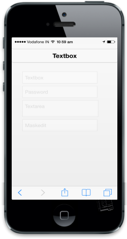

# Enable and Disable

The data-ej-enabled attribute is used to enable or disable your Textbox control. The default value is true.

Refer to the following code example.



     <input id="textbox_sample" data-role="ejmtextbox" data-ej-watermarktext="Textbox" data-ej-enabled="false">

     <input id="textbox_sample" data-role="ejmpassword" data-ej-watermarktext="Password" data-ej-enabled="false">

     <textarea id="textbox_sample" data-role="ejmtextarea" data-ej-watermarktext="Textarea" data-ej-enabled="false"></textarea>

     <input id="textbox_sample" data-role="ejmmaskedit" data-ej-watermarktext="Maskedit" data-ej-enabled="false" data-ej-mask=" +1 (999) 999-9999" />



{{ '' | markdownify }}
{:.image }

