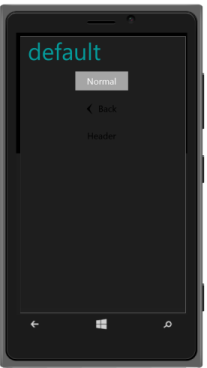

# Flat Specific Customization

You can set the Flat specific properties to the control by accessing Flat property.

## Style

You can change the style of Flat mode button by accessing data-ej-flat-style attribute 

The possible values are

1. Normal
2. Back
3. Header

You can refer to the following code example.



    

        <input type="button" id="sample_button" data-role="ejmbutton" data-ej-text="Normal" data-ej-rendermode="flat" data-ej-flat-style="Normal" />   

        <input type="button" id="sample_button1" data-role="ejmbutton" data-ej-text="Back" data-ej-rendermode="flat" data-ej-flat-style="back" />  

        <input type="button" id="sample_button2" data-role="ejmactionlink" data-ej-text="Header" data-ej-rendermode="flat" data-ej-flat-style="header" />

    



{  | markdownify }
{:.image }

