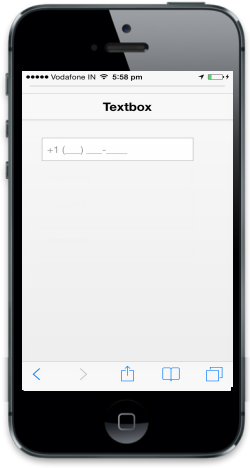

# Masking

It can be done using Mask EditTextbox control. When you define an input mask using the data-ej-mask attribute, each character position in the Mask Edit control maps to either a placeholder of a specified type or a literal character.

Refer to the following code example.



<input id="textbox_sample" data-role="ejmmaskedit" data-ej-watermarktext="Maskedit" data-ej-mask="+1 (999) 999-9999" />



{{ '' | markdownify }}
{:.image }

