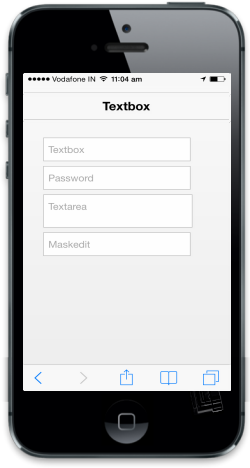

# ReadOnly

When data-ej-readonly is set to true, you cannot edit the value in the Textbox. The default value of this attribute is false.

Refer to the following code example.



    <input id="textbox_sample" data-role="ejmtextbox" data-ej-watermarktext="Textbox" data-ej-value="Textbox" data-ej-readonly="true">

    <input id="textbox_sample" data-role="ejmpassword" data-ej-watermarktext="Password" data-ej-value="password" data-ej-readonly="true">

    <textarea id="textbox_sample" data-role="ejmtextarea" data-ej-watermarktext="Textarea" data-ej-value="Textbox" data-ej-readonly="true"></textarea>

    <input id="textbox_sample" data-role="ejmmaskedit" data-ej-watermarktext="Maskedit" data-ej-mask=" +1 (999) 999-9999" data-ej-readonly="true" />



{  | markdownify }
{:.image }

