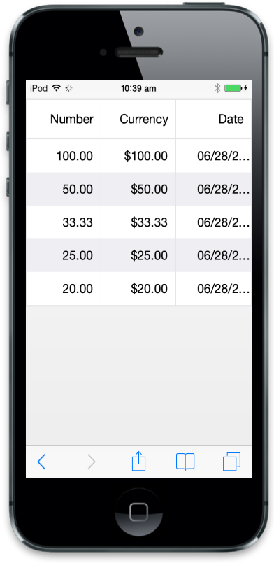
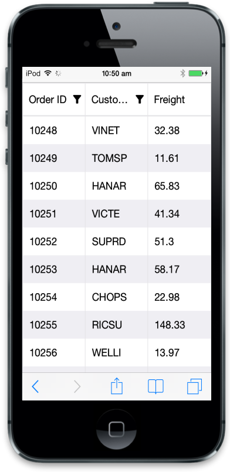
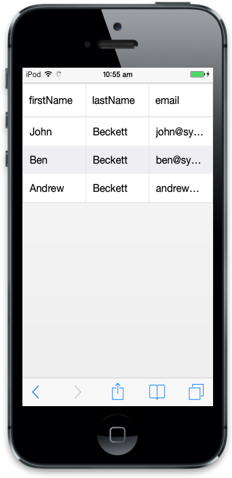
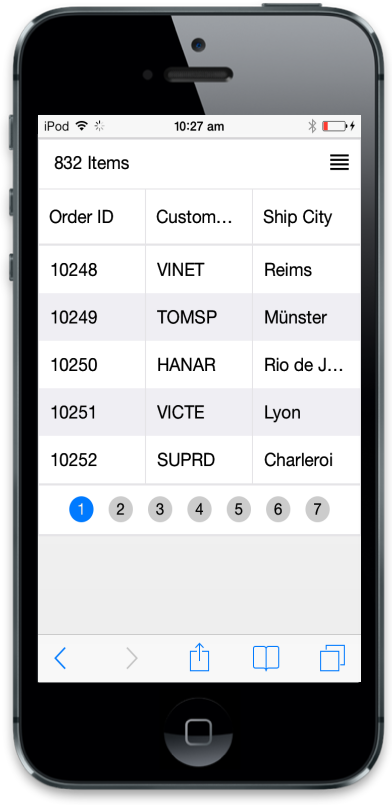
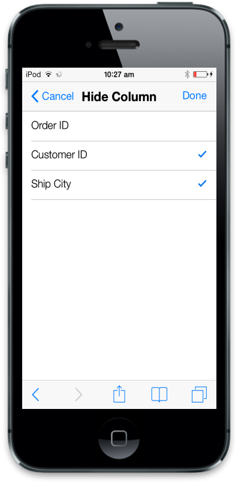
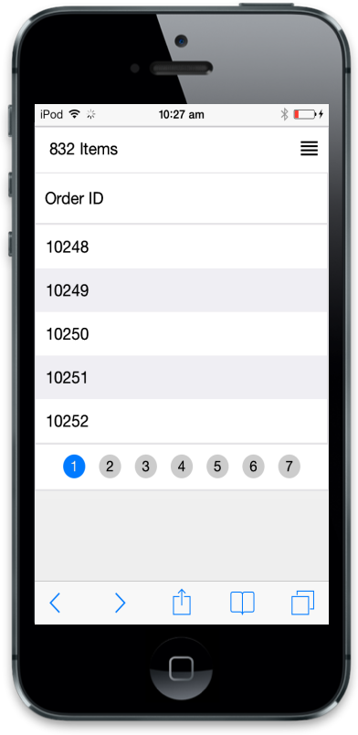

# Columns

Colums is a key feature in Grid to define schema in control based on datasource. It is useful to map field to datasource values.

## Formatting

Formatting is used to convert data values to human readable formats using specific culture settings. In Mobil Grid, you can use format attribute to format particular columns, for more refrence about globalize.js you can refer to the link ([https://github.com/jquery/globalize](https://github.com/jquery/globalize)). Refer to the following code to use formatting in Grid.





Refer to the following script section.



      $(function () {// Document is ready.

            window.data = [];

            for (i = 1; i < 6; i++) {

                window.data.push({ Number: 100 / i, Currency: 100 / i, Date: new Date() });

            }

            $("#MobileGrid").ejmGrid({

                // the datasource gets data

                dataSource: window.data,

                columns: [

                        // the formatting columns

                    { field: "Number", headerText: "Number", textAlign: ej.textAlign.Right, format: "{0:n2}", width: 70 },

                    { field: "Currency", headerText: "Currency", textAlign: ej.textAlign.Right, format: "{0:c2}", width: 70 },

                    { field: "Date", headerText: "Date", textAlign: ej.textAlign.Right, format: "{0:MM/dd/yyyy}", width: 70 }

                ],

            });

        });



Run the above code to render the following output.

### Controlling Mobile Grid actions

In ejmGrid, you can use allowSorting and allowFiltering to control Mobile Grid actions. Refer to the following code to disable particular column. In the following example, sorting action is controlled in ”CustomerID” column and filtering in “Freight” column.





Refer to the following script section.



        $(function () { // Document is ready.

            $("#MobileGrid").ejmGrid({

                // The datasource "window.gridData" is referred from jsondata.min.js

                dataSource: window.gridData,

                allowSorting: true,

                allowFiltering: true,

                columns:

            [

                { field: "OrderID", headerText: "Order ID" },

                { field: "CustomerID", headerText: "Customer ID", allowSorting: false },

                { field: "Freight", headerText: "Freight", allowFiltering: false }

            ]

            });

        });



Run the above code to render the following output.

### Auto-generate column

The Columns are automatically generated from the datasource and you no need to specify column declarations. Refer to the following code to auto generate column behavior with Grid.





Refer to the following script section.



    $(function () {// Document is ready.

        // Data for Mobile Grid.

        window.gridData = [

          { firstName: "John", lastName: "Beckett", email: "john@syncfusion.com" },

          { firstName: "Ben", lastName: "Beckett", email: "ben@syncfusion.com" },

          { firstName: "Andrew", lastName: "Beckett", email: "andrew@syncfusion.com" }

        ];

        $("#MobileGrid").ejmGrid({

            dataSource: window.gridData

        });

    });



Run the above code to render Auto-generate columns.

### Column Selection

By enabling “allowColumnSelector”, you can hide the columns dynamically whenever needed. This feature is mostly useful when the available device width is not enough to display all the necessary columns. 



    



Refer to the following script section.



        $(function () {

            var data = ej.DataManager({

                url: "http://mvc.syncfusion.com/Services/Northwnd.svc/Orders/"

            });

            $("#MobileGrid").ejmGrid({

                allowColumnSelector: true,

                dataSource: data,

                allowPaging: true,

                columns: [

                         { field: "OrderID", headerText: "Order ID" },

                         { field: "CustomerID", headerText: "Customer ID" },

                         { field: "ShipCity", headerText: "Ship City" }

                ]

            });

        });



Run the above code to render the following output.

