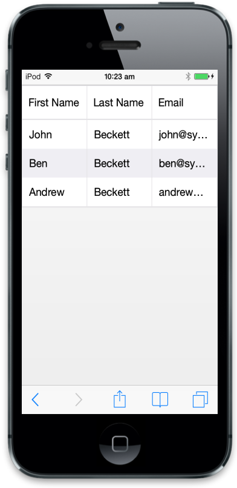
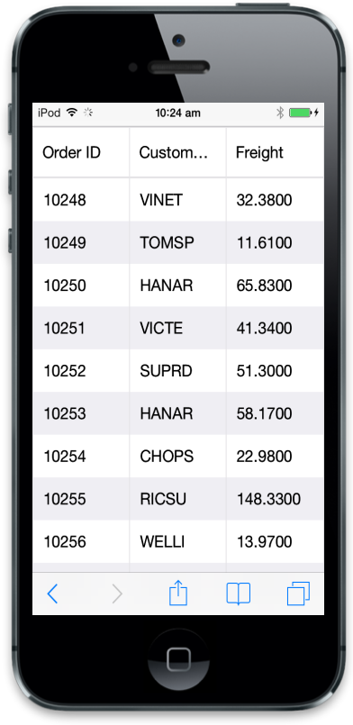
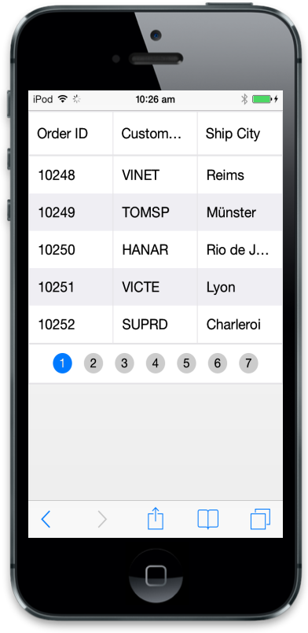
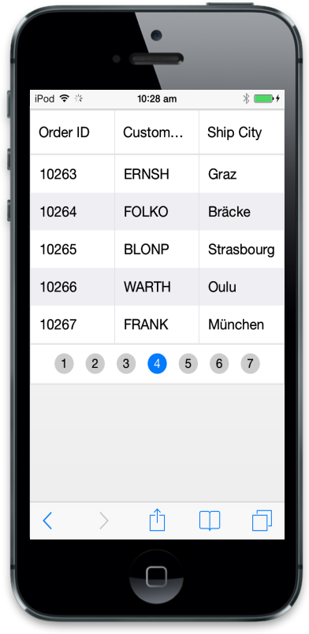
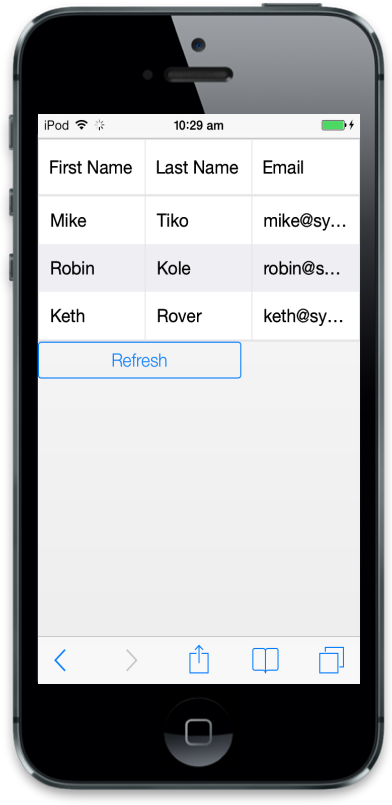
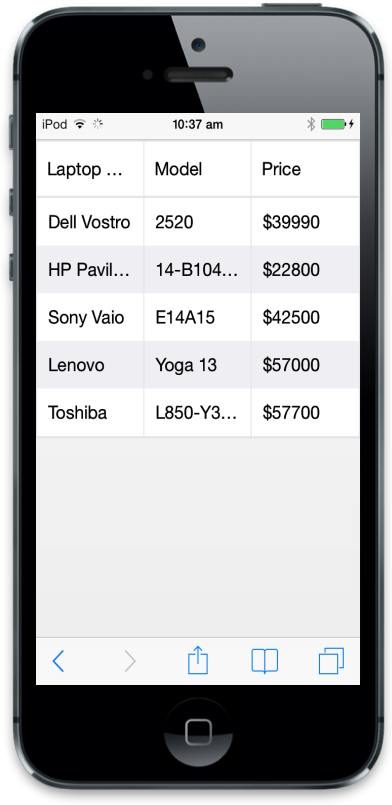
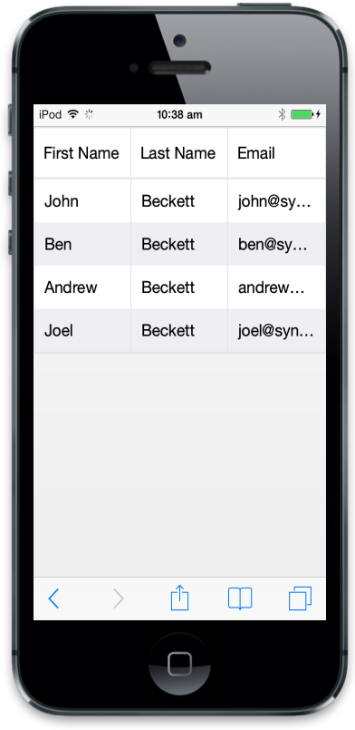
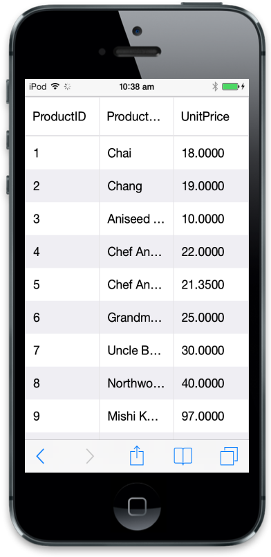

# Data binding

## Local data

Mobile Grid data source can be set in client-side through JavaScript. It has full support for JSON array binding. It is useful to bind records in client side using JSON data that is mostly helpful in Single Page Application (SPA) and feature rich web application. To achieve this refer to the following code example.



 



Refer to the following script section.



$(function () {// Document is ready.

	// Data for Mobile Grid.

	window.gridData = [

	  { firstName: "John", lastName: "Beckett", email: "john@syncfusion.com" },

	  { firstName: "Ben", lastName: "Beckett", email: "ben@syncfusion.com" },

	  { firstName: "Andrew", lastName: "Beckett", email: "andrew@syncfusion.com" }

	];

	$("#MobileGrid").ejmGrid({

		dataSource:window.gridData,

		columns: [

				 { field: "firstName",headerText:"First Name" },

				 { field: "lastName", headerText: "Last Name" },

				 { field: "email", headerText: "Email" }

		]

	});

});



Run the above code to render the following output.

## Remote data

### oData binding

oData is standardized protocol for creating and consuming data. You can able to retrieve data from oData service using DataManager.Here is an example of remote Data binding using oData service.



 



Refer to the following script section.



$(function () {// Document is ready.

//oData Adaptor with DataManager 

var data =    
	ej.DataManager("http://mvc.syncfusion.com/Services/Northwnd.svc/Orders");

	$("#MobileGrid").ejmGrid({

		dataSource: data,

		columns: [

				 { field: "OrderID", headerText: "Order ID" },

				 { field: "CustomerID", headerText: "Customer ID" },

				 { field: "Freight", headerText: "Freight" }

		]

	});

});



Run the above code to render the following output.

N> For information about DataManager with Mobie Grid check DataAdaptors concept.

### Load at once

Through this load at once technique, you can able to load all remote data from server to grid and process records in client side. You can check load at once with grid.



 



Refer to the following script section.



   $(function () {

	var data = ej.DataManager({

		url: "http://mvc.syncfusion.com/Services/Northwnd.svc/Orders/",

		offline: true

	});

	$("#MobileGrid").ejmGrid({

		dataSource: data,

		allowPaging: true,

		columns: [

				 { field: "OrderID", headerText: "Order ID" },

				 { field: "CustomerID", headerText: "Customer ID" },

				 { field: "ShipCity", headerText: "Ship City" }

		]

	});

});



Run the above code to render the following output.

## Cross domain 

ejmGrid can use cross domain data service with help of data manager. Following configuration is to configure in client side. You need to configure server to retrieve data from server code. For server configuration, you can refer to this link ([https://developer.mozilla.org/en-US/docs/Web/HTTP/Access_control_CORS](https://developer.mozilla.org/en-US/docs/Web/HTTP/Access_control_CORS)). Here you can learn how to use or retrieve cross domain data from Grid.



 



Refer to the following script section.



$(function () {// Document is ready.

	//DataManger 

	var dataManager = ej.DataManager({

		url: "http://mvc.syncfusion.com/UGService/api/Orders",

		crossDomain: true,

		offline: true

	});

	$("#MobileGrid").ejmGrid({

		allowPaging: true,

		dataSource: dataManager,

		columns: ["OrderID", "CustomerID", "EmployeeID", "ShipCity"]

	});

});



Run the above code to render the following output.

## Load on demand

Load on demand is a powerful technique that is used to reduce bandwidth size of consuming data. In ejmGrid, you have support to use load on demand. In the following example, oData service is used. At load time, it retrieves required data from service, only for the visible page and not for all records. And when you move to another page, it loads for current page. You no need to configure Grid to enable load on demand, since load on demand is enabled by default in Grid. The following code example illustrates you on how load on demand works with Mobile Grid.



 



Refer to the following script section.



$(function () {// Document is ready.

	//oData Adaptor with DataManager 

	var data = ej.DataManager({

		url: "http://mvc.syncfusion.com/Services/Northwnd.svc/Orders/"

	});

	$("#MobileGrid").ejmGrid({

		dataSource: data,

		columns: [

				 { field: "OrderID", headerText: "Order ID" },

				 { field: "CustomerID", headerText: "Customer ID" },

				 { field: "ShipCity", headerText: "Ship City" }

		],

		allowPaging:true

	});

});



Run the above code to render the following output.

## Refresh data source

ejmGrid contains a feature to refresh datasource dynamically after Grid initialization. It is useful to refresh grid data source.



 

<input data-role="ejmbutton" data-ej-text="Refresh" data-ej-touchend="RefreshData" />



Refer to the following script section.



$(function () {// Document is ready.

	// Data for Mobile Grid.

	window.gridData = [

	  { firstName: "John", lastName: "Beckett", email: "john@syncfusion.com" },

	  { firstName: "Ben", lastName: "Beckett", email: "ben@syncfusion.com" },

	  { firstName: "Andrew", lastName: "Beckett", email: "andrew@syncfusion.com" }

	];

	window.newData = [

	  { firstName: "Mike", lastName: "Tiko", email: "mike@syncfusion.com" },

	  { firstName: "Robin", lastName: "Kole", email: "robin@syncfusion.com" },

	  { firstName: "Keth", lastName: "Rover", email: "keth@syncfusion.com" }

	];

	$("#MobileGrid").ejmGrid({

		dataSource: window.gridData,

		columns: [

				 { field: "firstName", headerText: "First Name" },

				 { field: "lastName", headerText: "Last Name" },

				 { field: "email", headerText: "Email" }

		]

	});

});

function RefreshData() {

	$("#MobileGrid").ejmGrid({ dataSource: newData });

}



## Supported DataTypes

ejmGrid supports data types in JavaScript such as string, number, datetime and Boolean. By default, ejmGrid reads datatypes from Mobile Grid dataSource. Grid uses these DataTypes for filtering and other operations. You can also customize these DataTypes through column attribute type. It overrides default data type reading. For example refer to the following code.



$("#MobileGrid").ejmGrid({

	dataSource:window.gridData,

	columns: [

			 { field: "firstName",type:"string" },

			 { field: "lastName", type: "string" },

			 { field: "email" }

	]

});



## HTML Binding

ejmGrid has support to form Mobile Grid from HTML table. It is flexible to convert from table to Grid with the help of data manager. 



    <table id="Table1">

        <thead>

            <tr>

                <th>Laptop

                </th>

                <th>Model

                </th>

                <th>Price

                </th>

                <th>OS

                </th>

                <th>RAM

                </th>

                <th>ScreenSize

                </th>

            </tr>

        </thead>

        <tbody>

            <tr>

                <td>Dell Vostro</td>

                <td>2520</td>

                <td>39990</td>

                <td>Windows 8</td>

                <td>4GB</td>

                <td>15.6</td>

            </tr>

            <tr>

                <td>HP Pavilion Sleekbook</td>

                <td>14-B104AU</td>

                <td>22800</td>

                <td>Windows 8</td>

                <td>2GB</td>

                <td>14</td>

            </tr>

            <tr>

                <td>Sony Vaio</td>

                <td>E14A15</td>

                <td>42500</td>

                <td>Windows 7 Home Premium</td>

                <td>4GB DDR3 RAM</td>

                <td>14</td>

            </tr>

            <tr>

                <td>Lenovo</td>

                <td>Yoga 13</td>

                <td>57000</td>

                <td>Windows 8 RT</td>

                <td>2GB DDR3 RAM</td>

                <td>11.6</td>

            </tr>

            <tr>

                <td>Toshiba</td>

                <td>L850-Y3110</td>

                <td>57700</td>

                <td>Windows 8 SL</td>

                <td>8GB DDR3 RAM</td>

                <td>15.6</td>

            </tr>

        </tbody>

</table>



Refer to the following script section.



$(function () {// Document is ready.

	$("#MobileGrid").ejmGrid({

		dataSource: ej.DataManager($("#Table1")), // binding table to grid

		columns: [

				 { field: "Laptop", headerText: "Laptop Brands" },

				 { field: "Model", headerText: "Model" },

				 { field: "Price", headerText: "Price", format: " ${0:c}" }

		]

	});

});



Run the above code to render the following output.

## DataAdaptors

DataManger packed adaptor concept to process data. There are three types of adaptors in DataManger. They are

* JSON Adaptor
* Url Adaptor
* OData Adaptor

Here you can view how data bind data to grid using adaptor.

### JSON Adaptor

JSON adaptor is powerful way to define JSON data to Grid.  Using this technique you can able to use DataManger features to JSON before binding to Grid. Refer to the following code to use JSON Adaptor.



 



Refer to the following script section.



$(function () {// Document is ready.

	window.gridData = [

		{ firstName: "John", lastName: "Beckett", email: "john@syncfusion.com" },

		{ firstName: "Ben", lastName: "Beckett", email: "ben@syncfusion.com" },

		{ firstName: "Andrew", lastName: "Beckett", email: "andrew@syncfusion.com" }

	];

	//JSON adaptor with DataManager.

	var dataManager = ej.DataManager(window.gridData);

	dataManager.insert({ firstName: "Joel", lastName: "Beckett", email: "joel@syncfusion.com" });

	$("#MobileGrid").ejmGrid({

		dataSource: window.gridData,

		columns: [

				 { field: "firstName", headerText: "First Name" },

				 { field: "lastName", headerText: "Last Name" },

				 { field: "email", headerText: "Email" }

		]

	});

});



Run the above code to render the following output.

## oData adapter

Now a days oData is most useful technique in consuming data. You can use oData protocol through Data Manger’s OData adaptor. Refer to the following code to use oData adaptor with Grid.



 



Refer to the following script section.



$(function () {// Document is ready.

	//oData Adaptor with DataManager 

	var dataManager = ej.DataManager("http://mvc.syncfusion.com/Services/Northwnd.svc/Products");

	$("#MobileGrid").ejmGrid({

		dataSource: dataManager,

		columns: ["ProductID", "ProductName", "UnitPrice"]

	});

});



Run the above code to render the following output.

