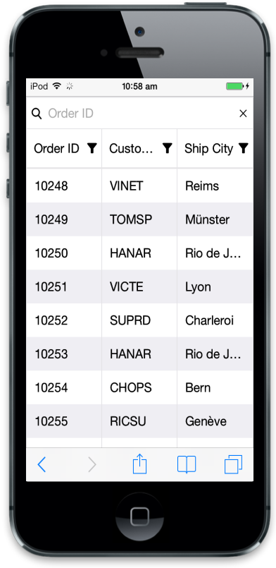

# Filtering

Filtering behavior is used to filter particular or related records in Mobile Grid to review details of records. To enable filtering behavior in Mobile Grid you need to add allowFiltering attribute at grid initialize. Filter Bar filtering feature is available in Mobile Grid. 

## Filter Bar

Filter bar is the filtering type available in Mobile Grid. It is otherwise called as text filtering because filter bar working is based on text boxes. Through this you can filter records. Filter bar contains expression to filter records. They are based on type of column. Refer to the following table for expression usage.

_Filter Bar Record Table_

<table>
<tr>
<td rowspan = "4">
Numeric column</td><td>
> value</td><td rowspan = "4">
To filter numeric column. You can use these expressions.</td></tr>
<tr>
<td>
< value</td></tr>
<tr>
<td>
= value</td></tr>
<tr>
<td>
!= value</td></tr>
<tr>
<td rowspan = "3">
String</td><td>
%value (Starts with)</td><td rowspan = "3">
By default , string filtering works starts with operator</td></tr>
<tr>
<td>
value% (Ends with)</td></tr>
<tr>
<td>
%value% (Contains)</td></tr>
<tr>
<td>
Date</td><td>
Equal</td><td>
By default, date filter bar matches records with same date value</td></tr>
<tr>
<td>
Boolean</td><td>
Equal</td><td>
Boolean filter bar works with either true or false.</td></tr>
</table>

 Refer to the following code example for filter bar

 

 





$(function () {// Document is ready.

	$("#MobileGrid").ejmGrid({

		dataSource: window.gridData,

		allowFiltering: true,

	});

});



Run the above code to render the following output.

## Filter Operators

ejmGrid uses filter operators from DataManager that is used at the time of filtering. Here you can learn about filter operators and its usage categories. Filter operators denotes filtering type.

_Filter Operators Table_

<table>
<tr>
<th>
Column type</th><th>
Filter operators</th></tr>
<tr>
<td>
Number</td><td>
ej.FilterOperators.greaterThan
ej.FilterOperators.greaterThanOrEqual
ej.FilterOperators.lessThan
ej.FilterOperators.lessThanOrEqual
ej.FilterOperators.equal</td></tr>
<tr>
<td>
String</td><td>
ej.FilterOperators.startsWith
ej.FilterOperators.endsWith
ej.FilterOperators.contains
ej.FilterOperators.equal
ej.FilterOperators.notEqual</td></tr>
<tr>
<td>
Boolean</td><td>
ej.FilterOperators.equal
ej.FilterOperators.notEqual</td></tr>
<tr>
<td>
Date</td><td>
ej.FilterOperators.greaterThan
ej.FilterOperators.greaterThanOrEqual
ej.FilterOperators.lessThan
ej.FilterOperators.lessThanOrEqual
ej.FilterOperators.equal</td></tr>
</table>