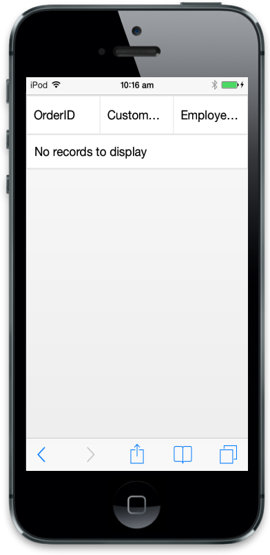

# How-To

## Initialize ejmGrid

In this section, you can learn the Mobile Grid’s mandatory attribute to render a simple Grid. To initialize Grid, it needs two important properties. They are columns and its inner attribute field. Columns are used to define schema of grid and field is mapping name to data source.



$("#MobileGrid").ejmGrid({

     columns: [

        { field: "OrderID" },

        { field: "CustomerID" },

        { field: "EmployeeID" }

     ]

});



Run the above code to render the following output.

## Get Mobile Grid object

After you initialize Mobile Grid, Grid object is stored in container element of Grid. To access Mobile Grid object refer to the following code example.



var gridObject = $("#MobileGrid").ejmGrid("instance");

                [or]

var gridObject = $("#MobileGrid ").data("ejmGrid");



