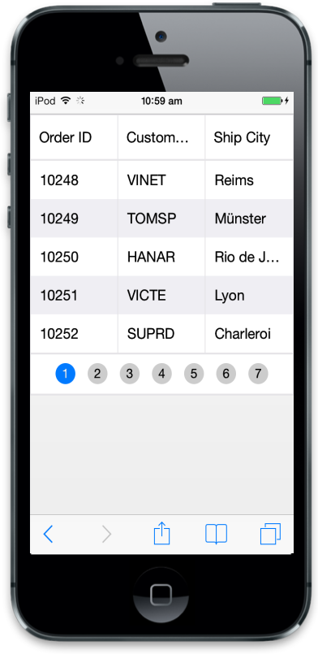
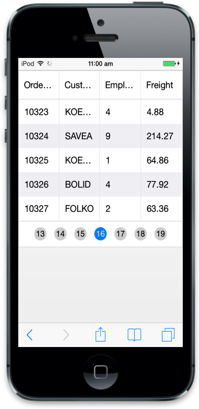

# Paging

Paging is a powerful technique in Mobile Grid that is used to Navigate from one page to another. Using this pager you can implement load on demand concept where it loads only required data to Grid. To enable paging in Grid set allowPaging as true at Mobile Grid initialize.

## Default

When the allowPaging is set as true, the properties in the pageSettings take the following default values.

* pageSize-5
* currentPage-1

Refer to the following code example for Grid with default options.





Refer to the following script section.



        $(function () {

            $("#MobileGrid").ejmGrid({

                // The datasource "window.gridData" is referred from jsondata.min.js

                dataSource: window.gridData,

                allowPaging: true 

            });

        });



Run the above code to render the following output.

### Pager Types

There are two types of pagers available in Mobile Grid. They are,

* Scrollable Pager: By specifying pager type as “scrollable” you can use this type of pager. By using this, you can scroll the pager bar for easy navigation.
* Normal Pager: By specifying pager type as “Normal” you can use this type of pager. This pager contains first, last, next and previous buttons for navigation.

In this section, you can learn how the pager types differ in Mobile Grid control. Refer to the following code example for pager types.





Refer to the lfollowing script section.



        $(function () { // Document is ready.

            $("#MobileGrid").ejmGrid({

                // The datasource "window.gridData" is referred from jsondata.min.js

                dataSource: window.gridData,

                allowPaging: true,

                pageSettings: { type: "scrollable" },

                columns:

            [

                { field: "OrderID", headerText: "Order ID" },

                { field: "CustomerID", headerText: "Customer ID" },

                { field: "EmployeeID", headerText: "Employee ID" },

                { field: "Freight", headerText: "Freight" }

            ]

            });

        });



Run the above code to render the following output.

