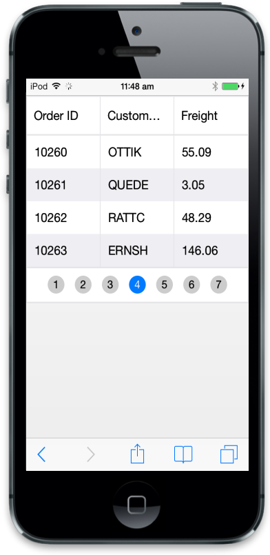

## Persist 

This section explains you on how to maintain Grid state. Refer to the following code example.



    

    



Refer to the following script section.



            $(function () {// Document is ready. 

        var data =    
           ej.DataManager("http://mvc.syncfusion.com/Services/Northwnd.svc/Orders");

            $("#MobileGrid").ejmGrid({

                dataSource: data, 

                enablePersistence: true,

                columns: [

                         { field: "OrderID", headerText: "Order ID" },

                         { field: "CustomerID", headerText: "Customer ID" },

                         { field: "Freight", headerText: "Freight" }

                ]

            });

        });



Run the above code to render the following output.

{{ '' | markdownify }}
{:.image }

