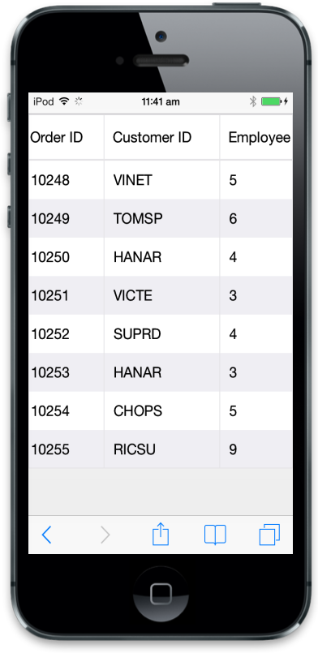
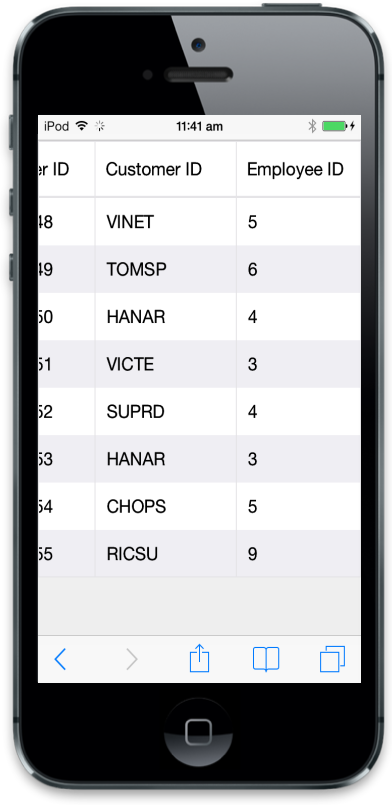

# Scrolling

## Default

Scrolling is an important feature in Mobile Grid. It makes Grid more compatible with layout. You can enable scrolling in Grid by using allowScrolling attribute in grid at grid initializes. In this following example, scrolling properties is used to adjust grid width and height of grid. Use the following code to enable scrolling feature in Mobile Grid. 





Refer to the following script section.



        $(function () { // Document is ready.

            $("#MobileGrid").ejmGrid({

                // The datasource "window.gridData" is referred from jsondata.min.js

                dataSource: window.gridData,

                allowScrolling: true,

                scrollSettings: { height: 352 },

                columns:

            [

                { field: "OrderID", headerText: "Order ID" },

                { field: "CustomerID", headerText: "Customer ID" },

                { field: "Freight", headerText: "Freight" }

            ]

            });

        });



Result of above code example.

### Column Scrolling

Column scrolling is powerful technique in ejmGrid. It makes Grid more compatible with layout. It is very useful feature for Mobile Grid with more columns. By enabling “enableColumnScrolling” attribute you can achieve column scrolling. 





Refer to the following script section.



        $(function () { // Document is ready.

            $("#MobileGrid").ejmGrid({

                // The datasource "window.gridData" is referred from jsondata.min.js

                dataSource: window.gridData,

                allowScrolling: true,

                scrollSettings: { enableColumnScrolling: true, height: 352 },

                columns:

            [

                         { field: "OrderID", headerText: "Order ID", width: 100 },

                         { field: "CustomerID", headerText: "Customer ID", width: 140 },

                         { field: "EmployeeID", headerText: "Employee ID", width: 140 },

                         { field: "Freight", headerText: "Freight", width: 100 }

            ]

            });

        });



Run the above code to render the following output.

