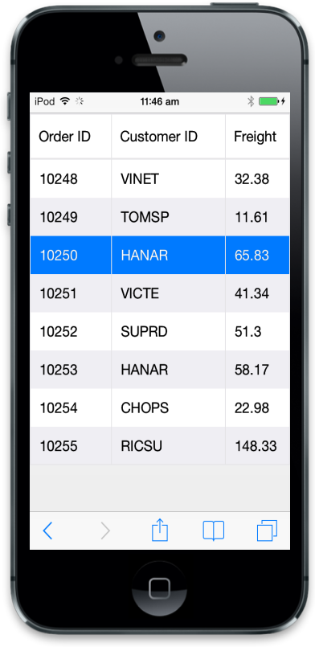
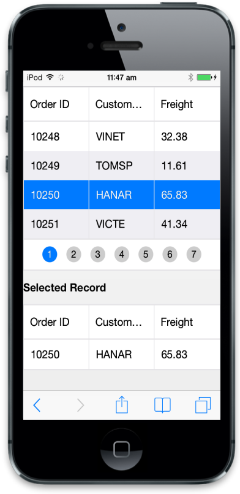

## Selection

The Selection attribute is used to highlight a row that you select. By default, the Mobile Grid allows row selection. Refer to the following code example.





Refer to the following script section.



        $(function () {

            $("#MobileGrid").ejmGrid({

                // The datasource "window.gridData" is referred from jsondata.min.js

                dataSource: window.gridData,

                allowPaging: true,

                allowSelection: true

            });

        });



Run the above code to render the following output.

{  | markdownify }
{:.image }

### Get Selected record data

In this section, you can learn how to get selected records from one Grid and also how those records are used to update datasource of another Grid. Refer to the following code example.



 

    <h2>Selected Record</h2>

    



Refer to the following script section.



        $(function () { // Document is ready.

            $("#MobileGrid").ejmGrid({

                dataSource: window.gridData,

                allowPaging: true,

                rowSelected: "onRowSelect",

                columns:

            [

                { field: "OrderID", headerText: "Order ID" },

                { field: "CustomerID", headerText: "Customer ID" },

                { field: "EmployeeID", headerText: "Employee ID" },

                { field: "Freight", headerText: "Freight" }

            ]

            });

            $("#NewGrid").ejmGrid({

                dataSource: window.gridData,

                allowPaging: true,

                columns:

            [

                { field: "OrderID", headerText: "Order ID" },

                { field: "CustomerID", headerText: "Customer ID" },

                { field: "EmployeeID", headerText: "Employee ID" },

                { field: "Freight", headerText: "Freight" }

            ]

            });

        });

        function onRowSelect(e) {

            $("#NewGrid").ejmGrid({ dataSource: [e.record] });

        }



{  | markdownify }
{:.image }

