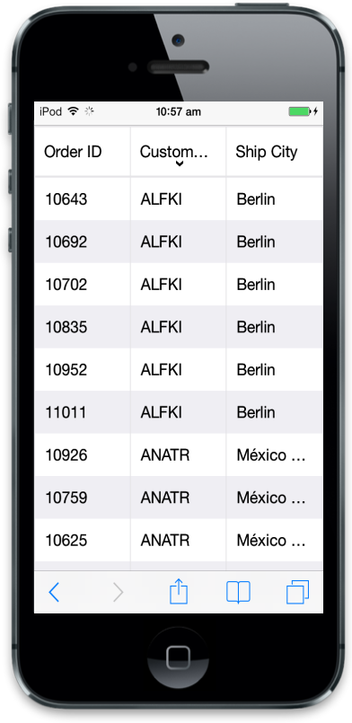
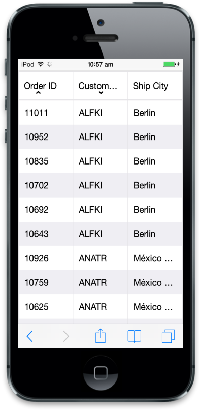

# Sorting 

## Default

Sorting is a basic technique in ejmGrid. It helps you in viewing grid records through ascending or descending based on particular column. If you want to enable sorting in Grid, use allowSorting attribute at Grid initialize. By default, sorting operation can perform through user interaction (UI) on Grid header.



    





        $(function () {

            var data = ej.DataManager({

                url: "http://mvc.syncfusion.com/Services/Northwnd.svc/Orders/"

            });

            $("#MobileGrid").ejmGrid({

                dataSource: data,

                allowSorting: true,

                columns: [

                         { field: "OrderID", headerText: "Order ID" },

                         { field: "CustomerID", headerText: "Customer ID" },

                         { field: "ShipCity", headerText: "Ship City" }

                ]

            });

        });



Result of the above code example:

### Multi Sorting

ejmGrid also has support to sort more than one column known as Multi sorting. To enable this behavior in Grid you can use allowMultiSorting in Mobile Grid. 



    



Refer to the following code example.



        $(function () {

            var data = ej.DataManager({

                url: "http://mvc.syncfusion.com/Services/Northwnd.svc/Orders/"

            });

            $("#MobileGrid").ejmGrid({

                dataSource: data,

                allowSorting: true, 

                sortSettings:{allowMultiSorting:true},

                columns: [

                         { field: "OrderID", headerText: "Order ID" },

                         { field: "CustomerID", headerText: "Customer ID" },

                         { field: "ShipCity", headerText: "Ship City" }

                ]

            });

        });



Run the above code to render the following output.

