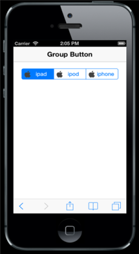
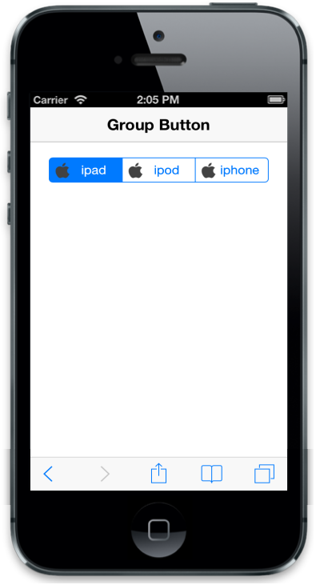

## Customize Image

### ImageClass

By using this attribute, you can add specific style to each Group Button item. When a string value is given to ‘data-ej-imageclass’ attribute, it adds as a class in the particular item. You can add an image or style by using that class. To achieve this, you can add ‘data-ej-imageclass’ attribute to every item.



<!-- Group Button rendering via radiobutton -->

    

        <label data-ej-imageclass="apple">

            <input type="radio" />ipad

        </label>

        <label data-ej-imageclass="apple">

            <input type="radio" />ipod

        </label>

        <label data-ej-imageclass="apple">

            <input type="radio" />iphone

        </label>

    



Add the following styles



        .apple {

            background: url("apple.png") no-repeat;

            background-position: 6px 50%;

            background-repeat: no-repeat;

            background-size: 20px 20px;

            position: relative;

            text-indent: 20px;

        }



The following screenshot displays the Image Class.

{{ '' | markdownify }}
{:.image }

### ImageUrl

data-ej-imageurl attribute takes the image given in ‘data-ej-imageurl’ attribute and displays the image before the text in Group Button item.



<!-- Group Button rendering via radiobutton -->

    

        <label data-ej-imageurl="apple.png">

            <input type="radio" />ipad

        </label>

        <label data-ej-imageurl="apple.png">

            <input type="radio" />ipod

        </label>

        <label data-ej-imageurl="apple.png">

            <input type="radio" />iphone

        </label>

    



The following screenshot displays the Image URL

{{ '' | markdownify }}
{:.image }

