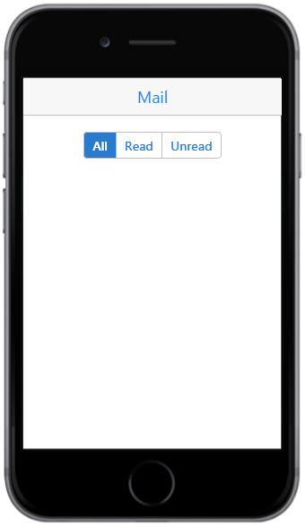
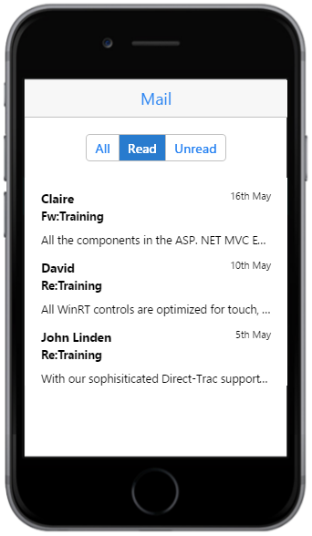
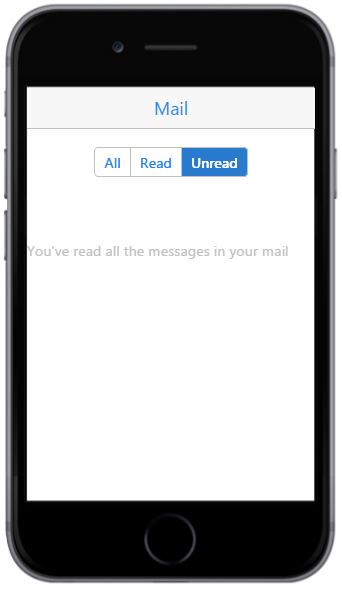

# Getting Started

The Essential JavaScript Group Button helps to display multiple buttons that is stacked together in a single line and looks like a navigation component. The following sections help you to create Group Button widget using a Mail App.

{{ '' | markdownify }}
{:.image }

Create Layout 

Essential JavaScript Group Button widget can be created using the HTML input elements with type “radio” or “checkbox”. In the Mail App, you can use the radio input element to view the Mail content with three options “All”, “Read” and “Unread”. The respective contents are displayed on clicking the specific button in the group. 

Create an HTML file and add the following template to the HTML file for Group Button creation.



<!DOCTYPE html>

<html>

<head>

<title>Group Button</title>

<link href="[http://cdn.syncfusion.com/13.1.0.21/js/mobile/ej.mobile.all.min.css](http://cdn.syncfusion.com/13.1.0.21/js/mobile/ej.mobile.all.min.css)" rel="stylesheet" />       

</head>

   <body>

     <div id="page" data-role="appview">

       <div id="header" data-ej-title="Mail"data-role="ejmheader">

         <div id="grpbutton_sample" class="sample">

           

               <!--Add Group Button control-->

           

         

        <!--Scroll Panel-->

        <div data-role="ejmscrollpanel" data-ej-target=" grpbutton_sample">
  

     

   </body>

       </html>



##Create Group Button

To create Group Button control you can set data-role attribute to ejmgroupbutton to a 
 element and you can include multiple buttons through input element. Also, specify the type and name attribute in the <input> element. Refer to the following code.



                <!—Group Button Control-->

        <div id="groupbutton" data-role="ejmgroupbutton" data-ej-selecteditemindex=0 >

             <label>

                <input type="radio" name="options">

                 All

             </label>

             <label>

                <input type="radio" name="options">

                 Read

             </label>

             <label>

                <input type="radio" name="options">

                 Unread

             </label>

        



Use the following styles for content.



        .appview .sample {

            padding-top: 20px;

            text-align: center;

        }

        .appview .cont-bg {

            text-align: left;

            padding-left: 20px;

            padding-right: 20px;

        }

        .appview .templatetext {

            font-size: 15px;

            font-weight: bolder;

            position: relative;

            top: 10px;

        }

        .appview .designationstyle {

            float: right;

            font-size: 12px;

            padding-top: 10px;

            position: relative;

        }

        .appview .message-title {

            font-weight: bold;

            font-size: 14px;

            padding-top: 10px;

        }

        .appview .aboutstyle {

            font-size: 14px;

            overflow: hidden;

            padding-top: 10px;

            text-align: justify;

            text-overflow: ellipsis;

            white-space: nowrap;

        }

        .appview .border-panel {

            height: 25px;

        }

        .appview .content-text {

            color: #C0C0C0;

            height: 0px;

        }

        #all, #read, #unread {

            padding-top: 20px;

        }



Execute this code to render the following output. 

{{ '' | markdownify }}
{:.image }

Handle Events

In the Mail App, while navigating through different buttons the content view is changed using touchEnd event. You can specify data-ej-touchend attribute. Using this event you can handle the functionalities that are necessary to switch the view. Refer to the following code.



<div id="groupbutton" data-role="ejmgroupbutton" data-ej-touchend="onselect" data-ej-selecteditemindex=0>

    <label>

        <input type="radio" name="options">

        All

    </label>

    <label>

        <input type="radio " name="options">

        Read

    </label>

    <label>

        <input type="radio" name="options">

        Unread

    </label>

<!--Add the Mail Content-->



Add the following script to the code



function onselect(args) {

    // Touch End Event Handling

}



In case, if you are using three options “All”, “Read” and “Unread” to view the mail content, it is done using the Essential JavaScript Mobile Listview control. Refer to the following code to create the listview control and to implement the switching logic through the GroupButton’s “touchEnd” event:



<div id="all">

    <div data-role="ejmlistview" id="templatelist" data-ej-allowscrolling="false"

         data-ej-datasource="window.dbAll" data-ej-databinding="true"

         data-ej-showheader="false" data-ej-rendertemplate="true">

        <div class="cont-bg">

            <span class="templatetext">{{>Name}}

            <span class="designationstyle">{{>Time}}

            <div class="message-title">{{>Title}}

            <div class="aboutstyle">{{>Message}}

        

    

<div id="read">

    <div data-role="ejmlistview" id="templatelist" data-ej-allowscrolling="false"

         data-ej-datasource="window.dbRead" data-ej-databinding="true"

         data-ej-showheader="false" data-ej-rendertemplate="true">

        <div class="cont-bg">

            <span class="templatetext">{{>Name}}

            <span class="designationstyle">{{>Time}}

            <div class="message-title">{{>Title}}

            <div class="aboutstyle">{{>Message}}

        

    

<div id="unread">

    <div class="border-panel">

    <div class="border-panel">

    <div class="content-text">You've read all the messages in your mail

    <div class="border-panel">

    <div class="border-panel">



To handle the events, add the following script to the code



    $(function () {//hiding read and unread elements initially

        $("#read").hide();

        $("#unread").hide();

    });

    //Touch End Event Handling

        function onselect(args) {

            $("#all,#read,#unread").hide();

            $("#" + args.text.toLowerCase()).show();

        }

    window.dbMailContent =

                [{ "Name": "John Linden", "Title": "Fw:Training", "Message": "All WinRT controls are optimized for touch, supporting common gestures: zooming,panning, selecting, double-tapping, rotating, resizing.", "Time": "20th May", "Flag": "All" },

                { "Name": "David", "Title": "Re:Training", "Message": "All the components in the ASP. NET MVC Essential Studio have been built from the ground up with performance in mind and are extremely lightweight.", "Time": "16th May", "Flag": "All" },

                { "Name": "Erik", "Title": "Re:Training", "Message": "Syncfusion Metro Studio is a collection of over 2500 Metro-style icon templates that can be easily customized to create thousands of unique Metro icons.", "Time": "10th May", "Flag": "All" },

                { "Name": "Claire", "Title": "Fw:Training", "Message": "All the components in the ASP. NET MVC Essential Studio have been built from the ground up with performance in mind and are extremely lightweight.", "Time": "16th May", "Flag": "Read" },

                { "Name": "David", "Title": "Re:Training", "Message": "All WinRT controls are optimized for touch, supporting common gestures: zooming,panning, selecting, double-tapping, rotating, resizing.", "Time": "10th May", "Flag": "Read" },

                { "Name": "John Linden", "Title": "Re:Training", "Message": "With our sophisiticated Direct-Trac support system, built from the ground up to support enterprise customers, you will have a streamlined experience working with our support team.", "Time": "5th May","Flag": "Read" }];

    window.dbAll = ej.DataManager(window.dbMailContent).executeLocal(ej.Query().from(window.dbMailContent).where(ej.Predicate("Flag", ej.FilterOperators.equal, "All")));

    window.dbRead = ej.DataManager(window.dbMailContent).executeLocal(ej.Query().from(window.dbMailContent).where(ej.Predicate("Flag", ej.FilterOperators.equal, "Read")));



Execute this code to render the following output. 

{{ '' | markdownify }}
{:.image }

{{ '' | markdownify }}
{:.image }

{{ '' | markdownify }}
{:.image }

