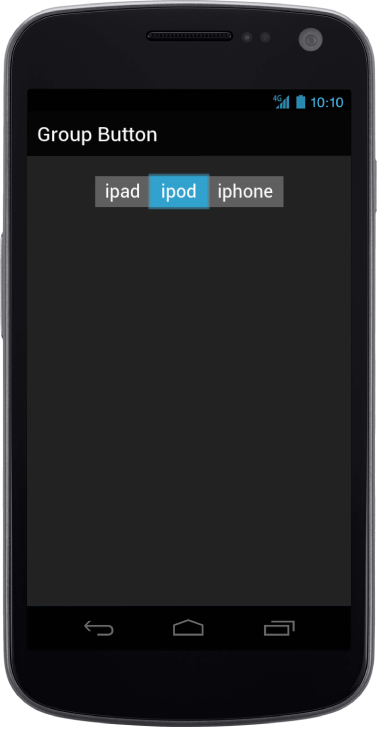

## Select Item

Group Button takes a numeric value given in the data-ej-selecteditemindex attribute and selects the corresponding item that matches the given index. Default value is 0.



<!-- Group Button rendering via radiobutton -->

    

        <label>

            <input type="radio" />ipad

        </label>

        <label>

            <input type="radio" />ipod

        </label>

        <label>

            <input type="radio" />iphone

        </label>

    



The following screenshot displays the Selected Item Index.

{  | markdownify }
{:.image }

