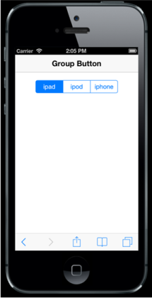

# Type

The Group Button is rendered via button and input tag elements. Group Button rendering is classified into three types: Button type, radio input type, and checkbox input type.

## Button



<!-- Group Button rendering via button tag -->

    

        <button>ipad</button>

        <button>ipod</button>

        <button>iphone</button>

    



## Radio Button



<!-- Group Button rendering via radiobutton -->

    

        <label>

            <input type="radio" />ipad

        </label>

        <label>

            <input type="radio" />ipod

        </label>

        <label>

            <input type="radio" />iphone

        </label>

    



## Checkbox



<!-- Group Button rendering via checkbox-->

    

        <label>

            <input type="checkbox" />ipad

        </label>

        <label>

            <input type="checkbox" />ipod

        </label>

        <label>

            <input type="checkbox" />iphone

        </label>

    



The following screenshot displays the Group Button.

