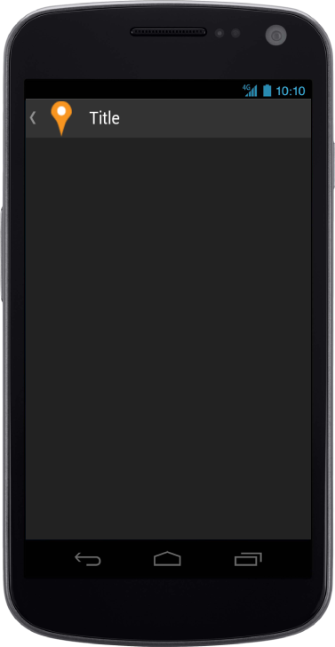

# Android specific customization

You can set the Android Specific properties to the control by accessing Android property.

## BackButtonImageClass

This feature specifies the class name in which an image for the back button is set.  Refer to the following code example.





Add the following styles to the content.



        .img {

            background: url("pin.png") no-repeat;

        }



The following screenshot displays the Android Specific customization:

