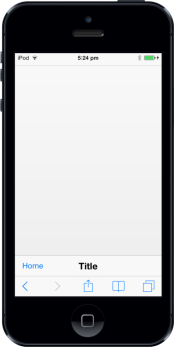

## Customize Footer Left Button

### ShowLeftButton

In Footer control, you can view the previous page by using the data-ej-showleftbutton. You can manually enable/disable the button by setting the true/false using data-ej-showleftbutton attribute.





The following screenshot displays the output.

{{ '' | markdownify }}
{:.image }

### LeftButtonCaption

To specify the caption (text) for Footer left button, set data-ej-leftbuttoncaption attribute. 



    



The following screenshot displays the output.

{{ '' | markdownify }}
{:.image }

### LeftButtonNavigationURL

Specifies the navigation URL to go to the page when the Left Button is clicked. 



      



