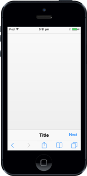

# Customize Footer Right Button

## ShowRightButton

In Footer control, you can view the next page by using the ShowRightButton. You can manually enable/disable the button by setting true/false using data-ej-showrightbutton attribute.



    

  



The following screenshot displays the output.

{{ '' | markdownify }}

## RightButtonCaption

To specify the caption (text) for Footer Right Button, set data-ej-rightbuttoncaption attribute. 





The following screenshot displays the output.

## RightButtonNavigationURL

Specifies the URL to which the page should be navigated when the Right Button is clicked.





