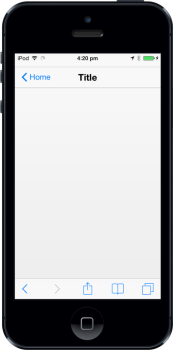
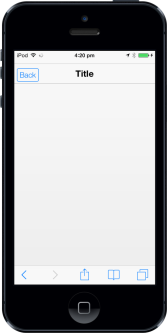

# Customize Header Left Button

## LeftButtonCaption

To specify the caption (text) for the Header left button, set the “data-ej-leftbuttoncaption” attribute. By default, the attribute value is set to back.



 



The following screenshot displays the Left Button Caption.

## LeftButtonStyle

The data-ej-leftbuttonstyle attribute specifies the style of the Header left button.

The possible values are, 

* Back
* Header
* Normal





The following screenshot displays the Left Button Style:

## LeftButtonNavigationURL

Specifies the navigation URL of the page while clicking the left button.



