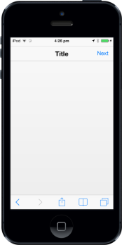
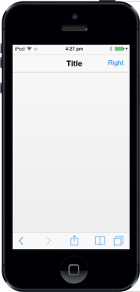

# Customize Header Right Button

## RightButtonCaption 

To specify the caption (text) for HeaderRight Button, set “data-ej-rightbuttoncaption” attribute. By default, the value is set to “Right”.





The following screenshot displays the Right Button Caption:

## RightButtonStyle

The data-ej-rightbuttonstyle attribute is used to specify the style of the Header right button.

The possible values are, 

* Header
* Normal





The following screenshot displays the Right Button Style:

## RightButtonNavigationURL

This feature specifies the navigation URL of the page while clicking the right button.





