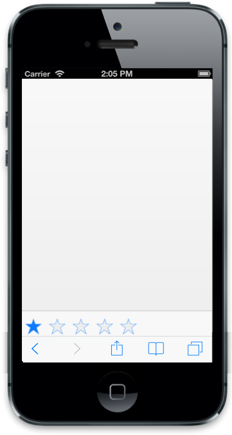

# Footer TemplateId

Footer has template support feature. The data-ej-templateid attribute is used to define the ID of the template element where you can specify the content to render in the Footer. 



	

  



The following screenshot displays the output.

