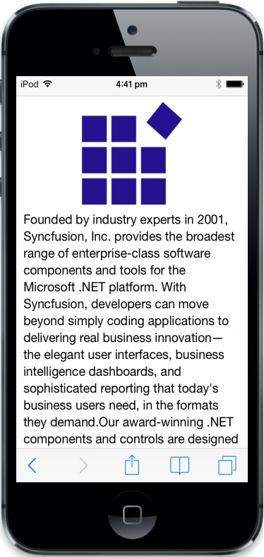
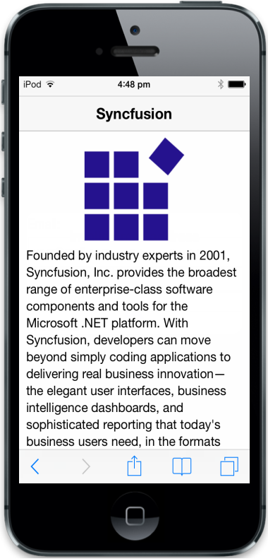
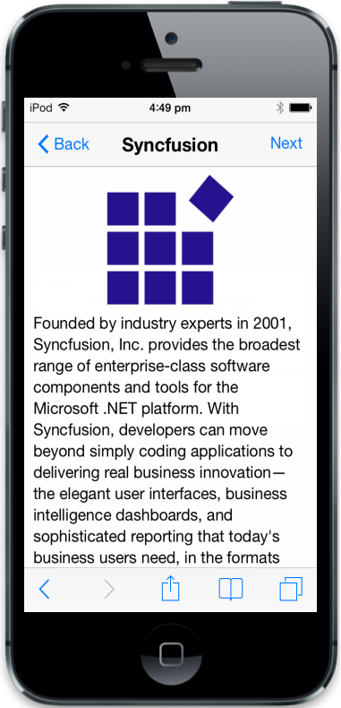
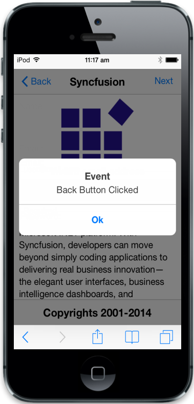
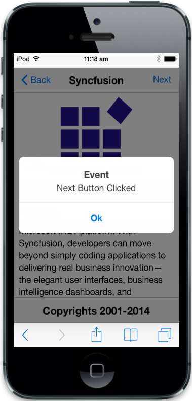

# Getting Started

The Essential JavaScript Mobile Header widget is placed at the top of the page. It usually contains page title and optional buttons positioned to the left and right for navigation or actions. Header position can be fixed according to the user. The Essential JavaScript mobile Footer widget is same structure as header at the bottom of the page. In the following guidelines, you will learn about features in mobile Header and Footer widget by creating a web page.

{  | markdownify }
{:.image }

Create the required layout

Header and Footer controls will be rendered based on the default values for all the properties. You can customize the Header and Footer controls by changing their properties according to your application need. The following steps will guide you to create a web page.

Create an HTML file and paste the following template to it for Photo Gallery App creation.



<!DOCTYPE html>

<html>

<head>

<title>Header and Footer</title>

<link href="[http://cdn.syncfusion.com/13.1.0.21/js/mobile/ej.mobile.all.min.css](http://cdn.syncfusion.com/13.1.0.21/js/mobile/ej.mobile.all.min.css)" rel="stylesheet" />

      

</head>

<body>

        <div id="page" data-role="appview">

        <!-- Adds Header Elements Here -->       

        <div id="content">

        
       

        <!-- Adds web page content Here -->

         <div class="companydetails">

                Founded by industry experts in 2001, Syncfusion, Inc. provides the broadest range of enterprise-class software components and tools

                for the Microsoft .NET platform. With Syncfusion, developers can move beyond simply coding applications to delivering real business innovation—the elegant

                user interfaces, business intelligence dashboards, and sophisticated reporting that today's business users need, in the formats they demand. Our award-winning

                .NET components and controls are designed to meet your evolving’ development needs, whether you're working in Windows Forms, WPF, ASP.NET, ASP.NET MVC, or Silverlight.

                At Syncfusion, we uncompromisingly strive for excellence in order to offer the very best value to our customers—from small ISVs to Fortune 100 companies.

        

        
        

        <!-- ScrollPanel -->	

 <div data-role="ejmscrollpanel" data-ej-target="content">

         <!-- Dialog -->

 <div id="dialog" data-role="ejmdialog" data-ej-title="Event" data-ej-leftbuttoncaption="Ok" data-ej-buttontap="dlgclose" data-ej-enablemodal="true">

            <div id="dlgcontent">

<!-- Adds Footer Elements Here -->

        

</body>

</html>



Use the following styles to add web page content element.



        .companydetails {

            margin: auto;

            width: 150px;

            height: 150px;

            background: url(http://js.syncfusion.com/UG/Mobile/Content/syncfusion.png) center / 150px 150px;

        }

        #content{

            padding:0 10px;

            text-align: justify;

        } 



Run this code and you can see the following output. 

{  | markdownify }
{:.image }

Create the Header Control

To render the Header control, you have to set “data-role” attribute to “ejmheader” to a div element. To set Header title using “data-ej-title” attribute with the desired title, in our case we set it as “Syncfusion”.





Run this code and you can see the following output. 

{  | markdownify }
{:.image }

Add Header buttons

To enable the Header buttons, you need to set “data-ej-showleftbutton” and “showrightbutton” attributes values as true.  You can set the button caption using “data-ej-leftbuttoncaption” and “data-ej-rightbuttoncaption” attribute with the desired caption. In our case, we set it as “Back” and “Next”.



 



Run this code and you can see the following output. 

{  | markdownify }
{:.image }

Handle Header buttons events

You can add functionalities for left and right Header buttons by triggering its events using “data-ej-leftbuttontap“ and “data-ej-rightbuttontap“ attributes. When you click the Header buttons, respective buttontap events will be called and can handle respective functions.

Refer to the following code example. 



<div id="header" data-role="ejmheader" data-ej-title="Syncfusion" data-ej-showleftbutton="true" data-ej-leftbuttoncaption="Back" data-ej-showrightbutton="true" data-ej-rightbuttoncaption="Next" data-ej-leftbuttontap="buttonclicked" data-ej-rightbuttontap="buttonclicked">



Add the following script to the code.



//Adding script for header buttons events

    function buttonclicked(args) {

$("#dlgcontent").html(args.text + " was selected");

      $("#dialog").ejmDialog("open");

    }

     function dlgclose() {

       $("#dialog").ejmDialog("close");

     }



Run this code and you can see the following output. 

<table>
<tr>
<td>

{:.image }
{{ '_Header left button event_' | markdownify }}</td><td>

{:.image }
{{ '_Header right button event_' | markdownify }}</td></tr>
</table>

Create Footer Control

To render the Footer control, you need to set data-role attribute to ejmfooter to a div element. To set Footer title “data-ej-title” attribute with the desired title, in our case we set it as “Copyrights 2001-2014”.





Run this code and you can see the following output. 

{  | markdownify }
{:.image }

